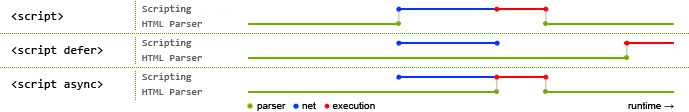

HTML（**H**yper**T**ext **M**arkup **L**anguage，超文本标记语言）是用来描述网页的一种语言，它不是一种编程语言，而是一种**标记**语言。


### HTML页面生命周期

html生命周期事件：

1. **DOMComtentLoaded**：浏览器已经加载完HTML，DOM树已经构建完毕之后会运行该事件。但像`` 和样式表灯外部资源可能并没有下载完毕。所以js可以访问所有DOM节点，初始化界面。
2. **load**：浏览器已经加载完所有资源（图像样式表等）。可以在此事件触发获取图像大小（如果没有被在HTML/CSS中指定）
3. **beforeunload/unload**：当用户离开页面时候触发。可以询问用户是否保存了更改以及是否确定要离开页面。

```js
  document.addEventListener('DOMContentLoaded', () => console.log('事件由document对象来触发'))
```


**DOMComtentLoaded和脚本`<script>`**

> **注意：UI渲染线程与JS引擎是互斥的，当JS引擎执行时UI线程会被挂起**

1、当浏览器在解析HTML页面时遇到了`<script>`标签，将无法继续构建DOM树，必须立即执行脚本。所以`DOMContentLoaded`有可能在所有脚本执行完毕后触发。外部脚本（带`src`的）的加载和解析也会暂停DOM树构建，所以`DOMContentLoaded`也会等待外部脚本

2、`<script async>`的脚本的加载和HTML的加载与解析是异步并行的。有async属性时在加载完毕后会立即执行并会阻塞HTML的解析。async的执行一定在load之前，但在DOMContentLoaded的之前和之后都有可能

3、`<script defer> ` 带有`defer`的脚本的下载是和HTML的下载与解析是异步的，但是js的执行会在HTML解析完之后执行，执行完defer之后才会走到 DOMContentLoad


**window.onload**

`window`对象上的`onload`事件在所有文件包括样式表，图片和其他资源下载完毕后触发

**window.unonload**

用户离开页面的时候，`window`对象上的`unload`事件会被触发，我们可以做一些不存在延迟的事情，比如关闭弹出的窗口，可是我们无法阻止用户转移到另一个页面上


### href和src区别

src 和 href 都是**用来引用外部的资源**

**src：**表示对资源的引用，它指向的内容会嵌入到当前标签所在的位置。src 会将其指向的资源下载并应⽤到⽂档内，如请求 js 脚本。当浏览器解析到该元素时，会暂停其他资源的下载和处理，直到将该资源加载、编译、执⾏完毕，所以⼀般 js 脚本会放在页面底部。常用的有script，img 、iframe

**href ：**表示超文本引用（hypertext reference），表示超文本引用，它指向一些网络资源，建立和当前元素或本文档的链接关系。当浏览器识别到它他指向的⽂件时，就会并⾏下载资源，不会停⽌对当前⽂档的处理。 常用在 a、link 等标签上。


### script 标签中 defer 和 async 的区别

如果没有 defer 或 async 属性，浏览器会立即加载并执行相应的脚本。它不会等待后续加载的文档元素，读取到就会开始加载和执行，这样就阻塞了后续文档的加载。

三者加载区别对比：



其中蓝色代表 js 脚本网络加载时间，红色代表 js 脚本执行时间，绿色代表 html 解析。

**defer 和 async 属性都是去异步加载外部的 JS 脚本文件，它们都不会阻塞页面的解析，但是async执行会阻塞页面解析。defer是页面解析完才执行。**


### 常⽤的 meta 标签有哪些

`meta` 标签由 `name` 和 `content` 属性定义，**用来描述网页文档的属性**，比如网页的作者，网页描述，关键词等，除了 HTTP 标准固定了一些`name`作为大家使用的共识，开发者还可以自定义 name。

常用的 meta 标签：

（1）`charset`，用来描述 HTML 文档的编码类型：

```
<meta charset="UTF-8" >
```

（2） `keywords`，页面关键词：

```
<meta name="keywords" content="关键词" />
```

（3）`description`，页面描述：

```
<meta name="description" content="页面描述内容" />
```

（4）`refresh`，页面重定向和刷新：

```
<meta http-equiv="refresh" content="0;url=" />
```

（5）`viewport`，适配移动端，可以控制视口的大小和比例：

```
<meta name="viewport" content="width=device-width, initial-scale=1, maximum-scale=1">
```

其中，`content` 参数有以下几种：

- `width viewport` ：宽度(数值/device-width)
- `height viewport` ：高度(数值/device-height)
- `initial-scale` ：初始缩放比例
- `maximum-scale` ：最大缩放比例
- `minimum-scale` ：最小缩放比例
- `user-scalable` ：是否允许用户缩放(yes/no）

（6）搜索引擎索引方式：

```
<meta name="robots" content="index,follow" />
```

其中，`content` 参数有以下几种：

- `all`：文件将被检索，且页面上的链接可以被查询；
- `none`：文件将不被检索，且页面上的链接不可以被查询；
- `index`：文件将被检索；
- `follow`：页面上的链接可以被查询；
- `noindex`：文件将不被检索；
- `nofollow`：页面上的链接不可以被查询。


### 行内元素有哪些？块级元素有哪些？ 空(void)元素有那些？

行内元素有：`a b span img input select strong`

块级元素有：`div ul ol li dl dt dd h1 h2 h3 h4 h5 h6 p`

空元素，即没有内容的 HTML 元素。空元素是在开始标签中关闭的，也就是空元素没有闭合标签：

常见的有：`<br>`、`<hr>`、``、`<input>`、`<link>`、`<meta>`

鲜见的有：`<area>`、`<base>`、`<col>`、`<colgroup>`、`<command>`、`<embed>`、`<keygen>`、`<param>`、`<source>`、`<track>`、`<wbr>`


### img 的 srcset 属性的作⽤？

响应式页面中经常用到根据屏幕密度设置不同的图片。这时就用到了 img 标签的 srcset 属性。srcset 属性用于设置不同屏幕密度下，img 会自动加载不同的图片。用法如下：

```

```

使用上面的代码，就能实现在屏幕密度为 1x 的情况下加载 image-128.png, 屏幕密度为 2x 时加载 image-256.png。

按照上面的实现，不同的屏幕密度都要设置图片地址，目前的屏幕密度有 1x,2x,3x,4x 四种，如果每一个图片都设置 4 张图片，加载就会很慢。所以就有了新的 srcset 标准。代码如下：

```

```

其中 srcset 指定图片的地址和对应的图片质量。sizes 用来设置图片的尺寸零界点。对于 srcset 中的 w 单位，可以理解成图片质量。如果可视区域小于这个质量的值，就可以使用。浏览器会自动选择一个最小的可用图片。

sizes 语法如下：

```
sizes="[media query] [length], [media query] [length] ... "
```

sizes 就是指默认显示 128px, 如果视区宽度大于 360px, 则显示 340px。


### iframe 有那些优点和缺点？

iframe 元素会创建包含另外一个文档的内联框架（即行内框架）。

**优点：**

- 用来加载速度较慢的内容（如广告）
- 可以使脚本并行下载
- 可以实现跨子域通信

**缺点：**

- iframe 会阻塞主页面的 onload 事件
- 无法被一些搜索引擎所识别
- 会产生很多页面，不容易管理


### src和href的区别

**1、请求资源类型不同**

href（Hypertext Reference）是超文本引用。用来建立当前元素和文档(引用资源)之间的链接。汝：link，a

src（source）是指向外部资源的位置，并替换当前元素。在请求src资源时会将指向的资源下载并应用到当前文档中，如：js脚本，img，iframe等

**2、作用结果不同**

href用于当前文档和引用资源之间确立联系

src是下载并替换当前标签内容

**3、浏览器解析方式不同**

href：浏览器会识别该文档为CSS文件，会并行下载资源并不会停止对当前文档的加载

src：当解析到src时，会停止其它资源的下载和处理，直到将该资源加载，编译，执行完毕。所以建议把js脚本放到底部。


### 优雅降级和渐进增强

**优雅降级：**graceful degradation 一开始就构建完整的功能，然后针对低版本浏览器进行兼容。

**渐进增强：**progressive enhancement 针对低版本浏览器进行构建页面，保证最基本的功能，然后针对高级浏览器进行效果、交互等改进和追加功能以达到更好的用户体验。

