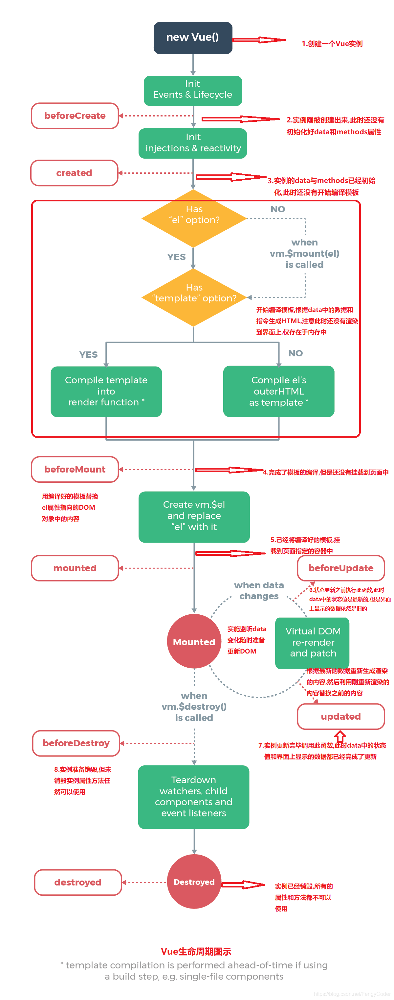
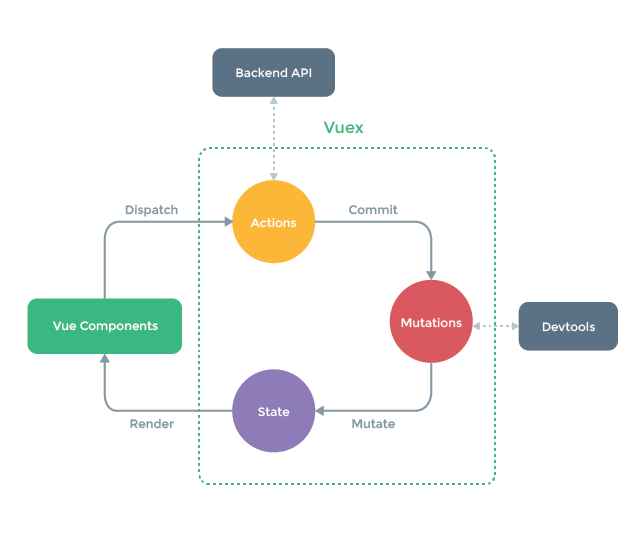

# my-resource


#### 1、Vue 生命周期的理解？

**（1）生命周期是什么？**

简单来说就是从Vue实例创建-运行-销毁的过程。

Vue 实例有一个完整的生命周期，也就是从开始创建、初始化数据、编译模版、挂载 Dom -> 渲染、更新 -> 渲染、卸载等一系列过程，我们称这是 Vue 的生命周期。

**（2）各个生命周期的作用**

创建期间生命周期方法：beforeCreate，created，beforeMount，mounted
运行期间生命周期方法：beforeUpdate，updated
销毁期间的生命周期方法：beforeDestroy，destroyed

| 生命周期      | 描述                                                         |
| ------------- | ------------------------------------------------------------ |
| beforeCreate  | 组件实例被创建之初，组件的属性生效之前                       |
| created       | 组件实例已经完全创建，属性也绑定，但真实 dom 还没有生成，$el 还不可用 |
| beforeMount   | 在挂载开始之前被调用：相关的 render 函数首次被调用           |
| mounted       | el 被新创建的 vm.$el 替换，并挂载到实例上去之后调用该钩子    |
| beforeUpdate  | 组件数据更新之前调用，发生在虚拟 DOM 打补丁之前              |
| update        | 组件数据更新之后                                             |
| activited     | keep-alive 专属，组件被激活时调用                            |
| deactivated   | keep-alive 专属，组件被销毁时调用                            |
| beforeDestory | 组件销毁前调用                                               |
| destoryed     | 组件销毁后调用                                               |

**（3）生命周期图解**



vue请求接口一般放在哪个生命周期？

可以在钩子函数 created、beforeMount、mounted 中进行调用，因为在这三个钩子函数中，data 已经创建，可以将服务端端返回的数据进行赋值。

一般推荐在 created 钩子函数中调用异步请求，因为在 created 钩子函数中调用异步请求有以下优点：

能更快获取到服务端数据，减少页面loading 时间；

ssr不支持 beforeMount 、mounted 钩子函数，所以放在 created 中有助于一致性；

如果涉及到需要页面加载完成之后的操作的话就用 mounted。mounted 阶段页面已经渲染完成，如果想请求之后进行 DOM 操作的话，必须在 mounted 阶段发起请求；


#### 2、MVC 和 MVVM 区别

MVC 全名是 Model View Controller。是一个软件架构设计模式

Model（模型）：模型是负责在数据库中存取数据的对象。是应用程序中用于处理应用程序数据逻辑的部分。

View（视图）：是应用程序中处理数据显示的部分。通常视图是依据模型数据创建的。

Controller（控制器）：是应用程序中处理用户交互的部分。通常控制器负责从视图读取数据，控制用户输入，并向模型发送


MVC 的思想：一句话描述就是 Controller 负责将 Model 的数据用 View 显示出来，换句话说就是在 Controller 里面把 Model 的数据赋值给 View。


MVVM全名是Model–View–ViewModel 。

View （视图），是应用程序中处理数据显示的部分。通常视图是依据模型数据创建的 。

Model （模型），模型是负责在数据库中存取数据的对象。是应用程序中用于处理应用程序数据逻辑的部分。

ViewModel（视图模型），做了两件事达到了数据的双向绑定 一是将【模型】转化成【视图】，即将后端传递的数据转化成所看到的页面。实现的方式是：数据绑定。二是将【视图】转化成【模型】，即将所看到的页面转化成后端的数据。实现的方式是：DOM 事件监听。


MVVM 与 MVC 最大的区别就是：它实现了 View 和 Model 的自动同步，也就是当 Model 的属性改变时，我们不用再自己手动操作 Dom 元素，来改变 View 的显示，而是改变属性后该属性对应 View 层显示会自动改变（对应Vue数据驱动的思想）

整体看来，MVVM 比 MVC 精简很多，不仅简化了业务与界面的依赖，还解决了数据频繁更新的问题，不用再用选择器操作 DOM 元素。因为在 MVVM 中，View 不知道 Model 的存在，Model 和 ViewModel 也观察不到 View，这种低耦合模式提高代码的可重用性

> *注意* ： Vue 并没有完全遵循 MVVM 的思想。
>
> 严格的 MVVM 要求 View 不能和 Model 直接通信，而 Vue 提供了$refs 这个属性，让 Model 可以直接操作 View，违反了这一规定，所以说 Vue 没有完全遵循 MVVM。


#### 3、Vue 是如何实现数据双向绑定的？

Vue 数据双向绑定主要是指：数据变化更新视图，视图变化更新数据


Vue 主要通过以下 4 个步骤来实现数据双向绑定的：

（1）实现一个监听器 **Observer**：对数据对象进行遍历，包括子属性对象的属性，利用 Object.defineProperty() 对属性都加上 setter 和 getter。这样的话，给这个对象的某个值赋值，就会触发 setter，那么就能监听到了数据变化。

（2）实现一个解析器 **Compile**：解析 Vue 模板指令，将模板中的变量都替换成数据，然后初始化渲染页面视图，并将每个指令对应的节点绑定更新函数，添加监听数据的订阅者，一旦数据有变动，收到通知，调用更新函数进行数据更新。

（3）实现一个订阅者 **Watcher**：Watcher 订阅者是 Observer 和 Compile 之间通信的桥梁 ，主要的任务是订阅 Observer 中的属性值变化的消息，当收到属性值变化的消息时，触发解析器 Compile 中对应的更新函数。

（4）实现一个订阅器 **Dep**：订阅器采用 发布-订阅 设计模式，用来收集订阅者 Watcher，对监听器 Observer 和 订阅者 Watcher 进行统一管理。


#### 4、说说 Vue 的单向数据流？

所有的prop使父子之间形成了一个**单向下行绑定**。父级 prop 的更新会向下流动到子组件中，但是反过来则不行。这样会防止从子组件意外改变父级组件的状态，从而导致你的应用的数据流向难以理解。每次父组件的值改变，子组件的prop也跟着更新。子组件想要修改时，通过$emit通知父组件去修改。


#### 5、为什么 data 是一个函数

每复用一次组件，都会以函数形式返回一个新的data数据。相当于给每个组件实例都创建一个私有数据空间，让各个组件独立维护各自数据。这样就不会一个改变，造成所有复用组件都跟着改变。


#### 6、什么是SPA（单页面应用程序）?

**SPA：**

SPA（ single-page application ）就是单页面应用程序。一旦页面加载完成，SPA 不会因为用户的操作而进行页面的刷新或跳转。SPA应用程序只有一个html文件,在vue中可以通过`vue-router`来局部切换组件,而非刷新整个页面,来实现无刷新切换页面的技术

优点：

1、用户体验好，内容改变不需要重新加载页面，避免了不必要的刷新和重复渲染

2、对服务器压力减小。

3、前后端分离，架构清晰。

缺点：

1、初次加载耗时多，在加载页面的时候将 JavaScript、CSS 统一加载，部分页面按需加载；

2、前进后退路由管理：因为单页面应用都在一个页面中显示内容，所以浏览器的前进后退不能用。所有页面切换需要自己建立管理栈。

3、SEO难度较大：所有内容都在一个页面中动态替换显示，所以爬虫搜索难度较大。


**MPA多页面应用：**

应用程序有多个html页面，多页应用跳转，需要整页资源刷新；vue多页面需要配置webpack，配置多个入口文件

优点：

首屏加载快；SEO比较友好

缺点：

页面切换加载缓慢；


**两者区别：**


#### 7、vue内置指令


#### 8、vue 组件间的通讯方式

1、props 和 $emit

父组件通过属性来传递给子组件，子组件通过prop接收传递的数据，子组件通过$emit触发父组件的事件

2、$attrs 和 $listeners

多级组件嵌套需要传递数据时使用。在创建高级别的组件时非常有用

3、provide 和 inject

父组件中通过 provide 来提供变量，子组件中通过 inject 来注入变量。

这对选项需要一起使用，以允许一个祖先组件向其所有子孙后代注入一个依赖，不论组件层次有多深，并在其上下游关系成立的时间里始终生效

```
// 父级组件提供 'foo'
var Provider = {
  provide: {
    foo: 'bar'
  },
  // ...
}

// 子组件注入 'foo'
var Child = {
  inject: ['foo'],
  created () {
    console.log(this.foo) // => "bar"
  }
  // ...
}
```

4、ref

标签定义 ref 属性名，通过 $refs 获取。如果在普通的 DOM 元素上使用，引用指向的就是 DOM 元素；如果用在子组件上，引用就指向组件实例

5、$parent 和 $children

来获取当前组件的父组件和子组件实例

6、envetBus

事件总线的方式，是一种设计模式，其现原理跟订阅/发布差不多；通过new Vue()创建一个实例，组件里面通过$on接收监听获取，通过$emit去触发数据的改变。

7、vuex

状态管理工具，

解决了使用envetBus时，当组件传递多了，导致难以维护阅读。


#### 9、v-model 的原理

v-model 在内部为不同的输入元素使用不同的 property 并抛出不同的事件。

1、text 和 textarea 元素使用 value property 和 input 事件；

2、checkbox 和 radio 使用 checked property 和 change 事件；

3、select 字段将 value 作为 prop 并将 change 作为事件


#### 10、computed 和 watch 的区别及原理

**computed：** 

1. 支持缓存，只有依赖的数据发生改变时才会重新计算
2. 不支持异步，当其中存在异步操作，是无法监听数据的变化
3. computed的值会默认走缓存，计算属性是基于它们响应式依赖进行缓存的，也就是基于data声明过的，或父组件传递过来的props中的数据进行计算的
4. 

**watch：** 

1. 不支持缓存，数据变化时，就会触发相应的操作
2. 支持异步操作
3. 当一个属性发生变化时，就需要执行相应操作
4. 监听的数据必须是data中声明的，或父级传递过来的props中的，
5. 监听的函数接收两个参数，第一个是新值，第二个是变化之前的值
6. 该监听还有两个属性：**immediate**，组件加载立即触发回调函数执行；**deep**，深度监听，发现数据内部的变化，在复杂的数据类型中使用，例如数组中的对象内容的改变。deep无法监听到数组的变动和对象的新增

**使用场景：**

如果一个属性是由其它属性计算而来的（依赖其它属性），一般使用computed

如果要监控某个属性变化去操作复杂业务逻辑，一般使用watch


**原理：**

**Watch源码的工作流程**
1.初始化组件上配置的watcher属性
2.对watcher属性可能的写法进行规整，得出key和handle
3.通过new Watcher 来创建一个基于key和handle的观察者
4.Watcher 的key为响应式的vm 上的变量，在watcher.get的时候，watcher订阅了对应key的变化。完成响应依赖。
5.当key的值发生了变化，触发watcher的更新方法，并执行回调函数handle

**computed源码的流程**
1.初始化的时候会获取computed里的定义。
2.通过遍历第一步的结果，按照computed新的变量名生成Watcher实例。
3.computed的watcher默认是lazy模式的，所以new Watcher 的时候不会调用watcher实例的get方法
4.vue 为computed 里的每个key 代理了一个新的get方法createComputedGetter()，当render页面的时候，新的get调用computed watcher实例的默认get方法。
5.computed执行自定义get方法的时候，会判断是否依赖有变动，没有的话，直接取值，否则去执行获取依赖的变量。
6.获取依赖变量的时候，将computed的watcher实例订阅到依赖的变量的Dep里。
7.走完这一步后，再调用计算列的watcher.depend将组件的watcher实例也订阅到计算列依赖的所有变量的dep中。
8.这样，当变量变化后，会通知computed的watcher将dirty设置为true， 以及组件的watcher更新dom。


**注意事项**

watcher 初始化是不执行的，如果想初始化就执行的话可以配置immediate属性

watcher和computed 属性定义的函数不能使用箭头函数，否则内部this会指向组件的父环境，比如window，导致调用失败


#### 11、vue 如何检测数组变化

在vue中修改数组索引和长度是无法监控到的。

数组考虑性能原因没有用 defineProperty 对数组的每一项进行拦截，而是要使用 7 种（push,shift,pop,splice,unshift,sort,reverse）数组方法进行修改才会触发数组对应的watcher 进行更新


#### 12、v-for和v-if为什么不能在同一个标签中使用

因为v-for 比 v-if 具有更高的优先级。解析时先解析 v-for 再解析 v-if。如果遇到需要同时使用时可以考虑使用计算属性进行过滤，然后再丢给vue进行渲染


#### 13、vue 中的 key 有什么作用？v-for 为什么要加 key

key是vue中vnode的唯一标志，通过key，diff操作更加精准，快速。

**更准确**：因为带 key 就不是就地复用了，在 sameNode 函数 a.key === b.key 对比中可以避免就地复用的情况。所以会更加准确。

**更快速**：利用 key 的唯一性生成 map 对象来获取对应节点，比遍历方式更快


#### 14、vue 修饰符有哪些

（1）**事件修饰符**

.stop阻止事件继续传播

.prevent阻止标签默认行为

.capture 使用事件捕获模式,即元素自身触发的事件先在此处处理，然后才交由内部元素进行处理

.self 只当在 event.target 是当前元素自身时触发处理函数

.once 事件将只会触发一次

.passive 告诉浏览器你不想阻止事件的默认行为

(2)**v-model 的修饰符**

.lazy 通过这个修饰符，转变为在 change 事件再同步

.number 自动将用户的输入值转化为数值类型

.trim 自动过滤用户输入的首尾空格

(3)**键盘事件的修饰符**

(4)**鼠标按钮修饰符**

(5)**系统修饰键**


#### 15、Vue模板编译原理

第一步是将 模板字符串 转换成 element ASTs（解析器） 

第二步是对 AST 进行静态节点标记，主要用来做虚拟DOM的渲染优化（优化器） 

第三步是 使用 element ASTs 生成 render 函数代码字符串（代码生成器）


#### 16、vue.set 方法原理

Vue **无法检测到对象属性的添加或删除**。由于 Vue 会在初始化实例时对属性执行 getter/setter 转化，所以属性必须在 data 对象上存在才能让 Vue 将它转换为响应式的。但是 Vue 提供了 `Vue.set (object, propertyName, value) / vm.$set (object, propertyName, value)`  来实现为对象添加响应式属性


#### 17、nextTick 使用场景和原理

在下次 DOM 更新循环结束之后执行延迟回调。在修改数据之后立即使用这个方法，获取更新后的 DOM。

原理是对promise等异步api的封装。


#### 18、对 keep-alive 的了解和使用场景

是 Vue 内置的一个组件，可以使被包含的组件保留状态，即实现组件缓存，避免重新渲染组件

- 提供 include和exclude属性， \- 字符串或正则表达式。include只有名称匹配的组件会被缓存，exclude则不缓存。
- 对应两个钩子函数 activated 和 deactivated。当组件被激活时触发钩子函数 activated；被移除时触发deactivated。 该钩子函数在服务器端渲染期间不被调用


#### 19、vue 的父子组件生命周期钩子函数执行顺序

（1）加载渲染过程

父 beforeCreate -> 父 created -> 父 beforeMount -> 子 beforeCreate -> 子 created -> 子 beforeMount -> 子 mounted -> 父 mounted

（2）子组件更新过程

父 beforeUpdate -> 子 beforeUpdate -> 子 updated -> 父 updated

（3）父组件更新过程

父 beforeUpdate -> 父 updated

（4）销毁过程

父 beforeDestroy -> 子 beforeDestroy -> 子 destroyed -> 父 destroyed


#### 20、服务端渲染 SSR

SSR就是服务端渲染。vue在客户端将标签渲染成的整个 html 的工作在服务端完成，就是由服务端生成的html返回给客户端直接渲染的过程就叫做服务端渲染。

**优点**

更好的 SEO。因为页面数据是通过请求服务器获取的，而搜索引擎抓取工具不会等页面异步渲染完在抓取。ssr直接返回渲染好的数据，所以更友好。

首屏加载更快。SPA应用会等所有js下载完后才进行页面渲染。而ssr无需等待下载js

**缺点**

开发条件会受到限制。服务端渲染只支持 beforCreate 和 created 两个钩子函数，当我们需要一些外部扩展库时需要特殊处理，服务端渲染应用程序也需要处于 Node.js 的运行环境。

服务器会有更大的负载需求。


#### 21、Diff 算法

简单来说就是通过真实dom描述出虚拟dom数，然后对节点进行遍历比较dom数差异，若有改变，进而把虚拟DOM转成真实DOM插入页面中渲染。


#### 22、vue为什么不直接操作DOM？

1、性能得损耗，操作DOM是及其损耗性能。所以虚拟DOM就诞生了。

2、过多的直接操作dom行为增加了代码的耦合性。当包含直接操作dom行为的组件在别处使用时，直接操作dom的代码有可能不可用。


#### 23、虚拟 DOM 是什么，有什么优缺点

Virtual DOM本质就是用一个原生的 JS 对象去描述一个树形结构虚拟 DOM 节点对象 。

**优点：**

（1）保证性能下限:  虚拟DOM可以经过diff找出最小差异,然后批量进行patch,这种操作虽然比不上手动优化,但是比起粗暴的DOM操作性能要好很多,因此虚拟DOM可以保证性能下限
（2）无需手动操作DOM:  虚拟DOM的diff和patch都是在一次更新中自动进行的,我们无需手动操作DOM,极大提高开发效率
（3）跨平台:  虚拟DOM本质上是JavaScript对象,而DOM与平台强相关,相比之下虚拟DOM可以进行更方便地跨平台操作,例如服务器渲染、移动端开发等

**缺点：**

无法进行极致优化: 在一些性能要求极高的应用中虚拟DOM无法进行针对性的极致优化，比如VScode采用直接手动操作DOM的方式进行极端的性能优化


#### 24、Vuex

Vuex 是一个专为 Vue.js 应用程序开发的状态管理模式。“store”基本上就是一个容器，它包含着你的应用中大部分的**状态 (state)**。和全局对象有以下两点不同。

1. Vuex 的状态存储是响应式的。当 Vue 组件从 store 中读取状态的时候，若 store 中的状态发生变化，那么相应的组件也会相应地得到高效更新。
2. 你不能直接改变 store 中的状态。改变 store 中的状态的唯一途径就是显式地**提交 (commit) mutation**。这样使得我们可以方便地跟踪每一个状态的变化。



**主要核心模块：**

State：是应用状态数据结构的存储对象，定义了应用状态的数据结构，可以在这里设置默认的初始数据状态。

Getter：允许组件从 Store 中获取数据，mapGetters 辅助函数仅仅是将 store 中的 getter 映射到局部计算属性。

Mutation：是唯一更改 store 中状态的方法，且必须是同步函数。

Action：通过commit提交 mutation，让mutation里的方法去改变，而不是直接变更状态，可以包含任意异步操作。

Module：允许将单一的 Store 拆分为多个 store 且同时保存在单一的状态树中。


**vuex特点**

1、遵循单向数据流

2、vuex里中的数据是响应式的


**Vuex解Vuex解决了什么问题？**

1、解决了多个组件依赖与同一状态时，对于多层嵌套传参非常繁杂，对兄弟组件专递无能为力。

2、可以来自不同组件需要变更同一状态。


**页面F5刷新vuex数据丢失问题**

Vuex是一个公共状态管理模式，但并不是数据库，所以要做持久保存一些数据。当用户刷新浏览器时数据很大可能会消失。F5刷新做了什么事呢，重新载入页面，销毁之前所有的数据。所以，F5页面刷新，页面销毁之前的资源，重新请求，因此写在生命周期里的vuex数据是重新初始化。持久化处理可以存到浏览器的sessionStorage/localStorage；或给store配置一个plugins。


**vuex数据传输流程**

1、通过new Vuex.Store()创建一个创库，state是公共状态，state到components渲染页面

2、在组件内部通过**this.$store.state.属性**来调用公共状态，进行渲染

3、当组件要修改数据时，必须遵循单向数据流。组件里在methods中扩展mapAction，调用store里的action里的方法

4、action中的每个方法都会接收一个对象，这对象里面有个commit方法，用来触发mutations里面的方法

5、mutations里的方法用来修改state里的数据，mutations里面的方法都会接收到2个参数，一个是store中的state， 另外一个是需要传递到参数

6、当mutations里的方法执行完后，state会发生改变，因为vuex是响应式的


#### 25、Vue-router

vue-router和vue.js是深度集成的,适合用于单页面应用.传统的路由是用一些超链接来实现页面切换和跳转.而vue-router在单页面应用中,则是组件之间的切换.**`其本质就是:建立并管理url和对应组件之间的映射关系.`**

vue-router 路由模式有几种？

有 3 种路由模式，分别是hash，history，abstract 

**`Hash模式就是通过改变#后面的值,实现浏览器渲染指定的组件.`**

**`History模式就是通过pushState()方法来对浏览器的浏览记录进行修改,来达到不用请求后端来渲染的效果`**


**动态路由和固定路由区别和实现方式：**


**路由守卫（跳转或拦截）：**

“导航”表示路由正在发生改变。路由守卫提供的守卫主要用来通过跳转或取消的方式守卫导航。有多种机会植入路由导航过程中：全局的, 单个路由独享的, 或者组件级的。

简单的说，导航守卫就是路由跳转过程中的一些钩子函数。路由跳转是一个大的过程，这个大的过程分为跳转前中后等等细小的过程，在每一个过程中都有一函数，这个函数能让你操作一些其他的事儿，这就是导航守卫。类似于组件生命周期钩子函数

**（1）全局守卫：**


**（2）组件守卫：**

**（3）守卫：**

**路由生命周期：**


[传送门](https://juejin.cn/post/6844903665388486664)


#### 26、vue3.0 你了解多少

1. 响应式原理的改变，Vue3.x 使用 Proxy 取代 Vue2.x 版本的 Object.defineProperty。vue3的Proxy 可以直接监听对象和数组的变化。

2. 组件选项声明方式，Vue3.x 使用 Composition API setup 是 Vue3.x 新增的一个选项， 他是组件内使用 Composition API 的入口。在`vue2.0`里我们都把`.vue`文件里的`js`部分叫做`Options API`， 而在3.0里变为`Composition API`。

3. template模板语法变化；slot 具名插槽语法；自定义指令；v-model 的升级

4. 其它方面的更改，Suspense 支持 Fragment（多个根节点）和 Protal（在 dom 其他部分渲染组建内容）组件，针对一些特殊的场景做了处理。 基于 treeshaking 优化，提供了更多的内置功能。

5. main.js，新增createApp方法

   

#### 27、对Vue 的性能的优化

**（1）代码层面的优化**

- v-if 和 v-show 区分使用场景
- 减少接口请求
- computed 和 watch  区分使用场景
- v-for 遍历必须为 item 添加 key，且避免同时使用 v-if
- 长列表性能优化。优化无限列表性能
- 防止内部泄漏，组件销毁后把全局变量和事件销毁
- 图片资源懒加载
- 路由懒加载
- 第三方插件的按需引入
- 防抖、节流的运用
- 适当采用 keep-alive 缓存组件
- 服务端渲染 SSR 或 预渲染

**（2）Webpack 层面的优化**

- Webpack 对图片进行压缩
- 减少 ES6 转为 ES5 的冗余代码
- 提取公共代码
- 模板预编译
- 提取组件的 CSS
- 优化 SourceMap
- 构建结果输出分析
- Vue 项目的编译优化

**（3）基础的 Web 技术的优化**

- 开启 gzip 压缩
- 浏览器缓存
- CDN 的使用
- 使用 Chrome Performance 查找性能瓶颈


#### 28、vue的双向绑定

https://blog.csdn.net/weixin_52092151/article/details/119810514


#### vue.use()和vue.prototype区别

vue.prototype：就是把属性/方法挂载到vue实例的原型下，每个组件都是vue的实例所以都能直接获取到添加的属性/方法。

vue.use：通过vue.use引入插件。若传入对象，则必须提供install方法，会查找对象下的install函数并执行；否则传入函数，把该函数当作install函数执行。vue.use的源码执行过程中会检测是否安装过插件，否则执行install函数安装。

有些插件不规范又或者不是按照vue规则设计（准确地说不是专门为VUE服务），里面没有install方法，那么就通过添加到vue原型链上的方式使用。


#### mixin，extend，component的使用和区别

**Mixin：**

若命名相同（生命周期或对象和函数），将会通过vue的策略进行合并或覆盖相同属性或函数名。

`Vue.extend()` 也使用同样的策略进行合并。

避免使用全局混入，因为它会影响每个单独创建的 Vue 实例 (包括第三方组件)。

**mixins：** 则用于组件内以数组的形式接收混入对象，可以接收多个。

**extend：**实际上extend是创建一个构造器，再通过创建这个构造器的实例并使用$mount挂载到一个元素上

**extends：**允许声明扩展另一个组件 (可以是一个简单的选项对象或构造函数)，而无需使用 `Vue.extend`。这主要是为了便于扩展单文件组件。和 `mixins` 类似


**extend,extends, mixins 区别**
Vue.extend创建组件的构造函数，为了复用

mixins可以混入多个mixin，extends只能继承一个

mixins类似于面向切面的编程（AOP），extends类似于面向对象的编程

mixins和extends是为了拓展组件功能；Vue.extend只是创建一个构造器,他是为了创建可复用的组件

优先级Vue.extend>extends>mixins


**Vue.component和Vue.extend区别**

component：注册或获取全局组件；内部实质上调用了vue.extend，最后返回子类构造器。其作用是将通过 Vue.extend 生成的扩展实例构造器注册为一个组件；


