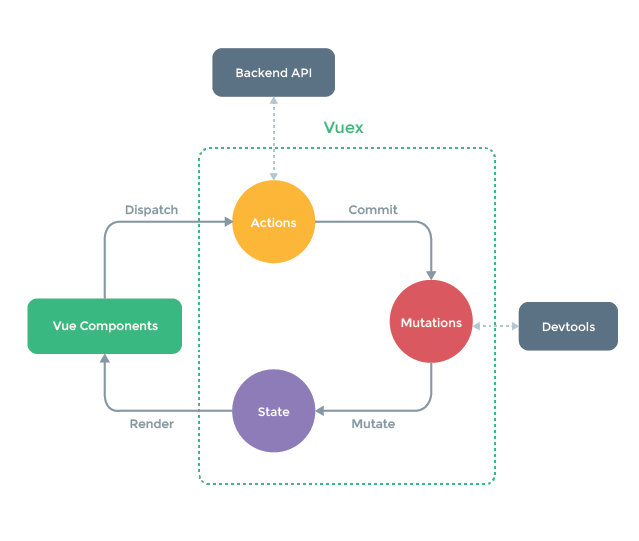
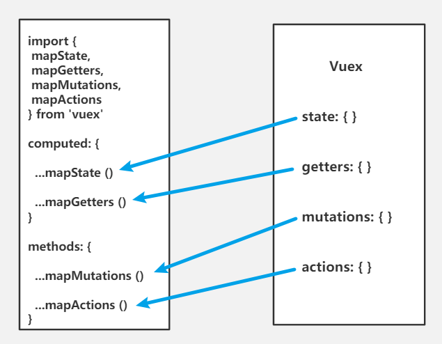

### Vuex状态管理

#### 概念

Vuex 是一个专为 Vue.js 应用程序开发的状态管理模式。“store”基本上就是一个容器，它包含着你的应用中大部分的**状态 (state)**。和全局对象有以下两点不同。

1. Vuex 的状态存储是响应式的。当 Vue 组件从 store 中读取状态的时候，若 store 中的状态发生变化，那么相应的组件也会高效更新
2. 你不能直接改变 store 中的状态。改变 store 中的状态的唯一途径就是显式地通过 **(commit) 提交mutation**。这样使得我们可以方便地跟踪每一个状态的变化。



**主要核心模块：**

State：是应用状态数据结构的存储对象，定义了应用状态的数据结构，可以在这里设置默认的初始数据状态。

Getter：允许组件从 Store 中获取数据，mapGetters 辅助函数仅仅是将 store 中的 getter 映射到局部计算属性。

Mutation：是唯一更改 store 中状态的方法，且必须是同步函数。

Action：通过commit提交 mutation，让mutation里的方法去改变，而不是直接变更状态，可以包含任意异步操作。

Module：允许将单一的 Store 拆分为多个 store 且同时保存在单一的状态树中。


**vuex特点**

1、遵循单向数据流

2、vuex里中的数据是响应式的


**Vuex解Vuex解决了什么问题？**

1、解决了多个组件依赖与同一状态时，对于多层嵌套传参非常繁杂，对兄弟组件专递无能为力。

2、可以来自不同组件需要变更同一状态。


**缺点：刷新页面vuex数据丢失**

Vuex是一个公共状态管理模式，但并不是数据库，所以要做持久保存一些数据。当用户刷新浏览器时数据很大可能会消失。F5刷新做了什么事呢，重新载入页面，销毁之前所有的数据。所以，F5页面刷新，页面销毁之前的资源，重新请求，因此写在生命周期里的vuex数据是重新初始化。持久化处理可以存到浏览器的sessionStorage/localStorage；或给store配置一个plugins。


**vuex数据传输流程**

1、通过new Vuex.Store()创建一个创库，state是公共状态，state到components渲染页面

2、在组件内部通过**this.$store.state.属性**来调用公共状态，进行渲染

3、当组件要修改数据时，必须遵循单向数据流。组件里在methods中扩展mapAction，调用store里的action里的方法

4、action中的每个方法都会接收一个对象，这对象里面有个commit方法，用来触发mutations里面的方法

5、mutations里的方法用来修改state里的数据，mutations里面的方法都会接收到2个参数，一个是store中的state， 另外一个是需要传递到参数

6、当mutations里的方法执行完后，state会发生改变，因为vuex是响应式的


#### 辅助函数：

辅助函数：mapState、mapGetters、mapMutations、mapActions

辅助函数map作用：简化使用state，getters，mutatioins，actions





> **说明：若没有在其它模块下则不用加模块名；若是在其它模块下则要加模块名直到指到对应模块**
>
> 文中 xxx 是属性名


**mapState：**

直接使用： `this.$store.state.模块名.xxx`


辅助函数：

```
// ... 是把对象展开并合并到computed里
computed： {
	// 
	...mapState(['xxx','xxx']),
	...mapState({
		'自定义名': 'xxx',
		'自定义名': state=>state.xxx,
		// 
		'自定义名' (state) {
      		return state.xxx + this.xxx
    	}
	})
	
	// 在其它模块下
	...mapState('模块名',['xxx','xxx']),
	...mapState('模块名/模块名',{'自定义名': state=>state.模块名.xxx})
}
```


**mapGetters：**

直接使用：`this.$store.getters.模块名.xxx`


辅助函数：

```
computed: { 
	// 
	...mapGetters(['xxx']),
	...mapGetters({ '自定义名': 'xxx' })
	
	// 在其它模块下
    ...mapGetters('模块名', ['xxx']), 
    ...mapGetters('模块名',{'自定义名': 'xxx'})
}
```


**mapMutations：**

直接使用：`this.$store.commit('模块名/mutation名', 参数)`


辅助函数：

```
methods: { 
  ...mapMutations(['mutation名']), 
  ...mapMutations({'新名字': 'mutation名'})
  
  // 在其它模块下
  ...mapMutations('模块名', ['mutation名']), 
  ...mapMutations('模块名',{'新名字': 'mutation名'})
}
```


**mapActions：**

直接使用：`this.$store.dispatch('模块名/action名',参数)`

辅助函数：

```
methods: { 
  ...mapActions(['action名']), 
  ...mapActions({'新名字': 'action名'})
  
  // 在其它模块下
  ...mapActions('模块名', ['action名']), 
  ...mapActions('模块名',{'新名字': 'action名'})
}
```


> 如果存在命名空间namespaced为true，则需要额外去补充模块名