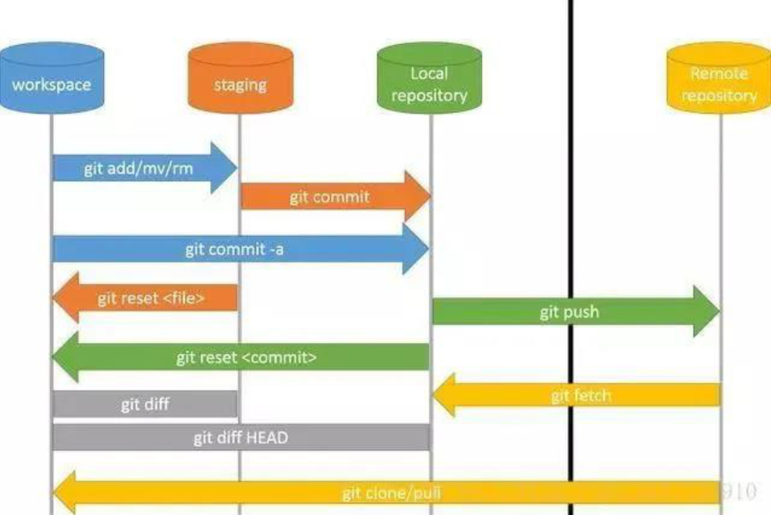

### SVN与Git概念

**Git 概念：**

Git是一个分布式版本控制系统

Git 最核心的一个概念就是工作流。

- 工作区(Workspace)是电脑上能看到的相关目录。
- 暂存区(Stage/index)类似于缓存区域，临时保存你的改动。
- 仓库区(Repository)，分为本地仓库和远程仓库。

通常提交代码分为三步：

1. git add从工作区提交到暂存区
2. git commit从暂存区提交到本地仓库
3. git push从本地仓库提交到远程仓库


操作图如下：




**SVN 概念：**

SVN是集中式的版本控制系统


- **repository（源代码库）：**源代码统一存放的地方
- **Checkout（提取）：**当你手上没有源代码的时候，你需要从repository checkout一份
- **Commit（提交）：**当你已经修改了代码，你就需要Commit到repository
- **Update (更新)：**当你已经Checkout了一份源代码， Update一下你就可以和Repository上的源代码同步，手上的代码就会有最新的变更

通常提交代码分为两步：

1. Update（获得最新的代码）
2. 修改后 Commit（大家就可以看到你的修改了）


### SVN与Git区别

**1、Git 是分布式的，SVN 不是**：这是 Git 和其它非分布式的版本控制系统，如 SVN，CVS 等，最核心的区别。

**2、Git 把内容按元数据方式存储，而 SVN 是按文件：**所有的资源控制系统都是把文件的元信息隐藏在一个类似 .svn、.cvs 等的文件夹里。

**3、Git 分支和 SVN 的分支不同：**分支在 SVN 中一点都不特别，其实它就是版本库中的另外一个目录。

**4、Git 没有一个全局的版本号，而 SVN 有：**目前为止这是跟 SVN 相比 Git 缺少的最大的一个特征。

**5、Git 的内容完整性要优于 SVN：**Git 的内容存储使用的是 SHA-1 哈希算法。这能确保代码内容的完整性，确保在遇到磁盘故障和网络问题时降低对版本库的破坏。

**6、Git可以离线操作，SVN必需要有网络**


### SVN与Git优缺点

**Git：**

优点：速度快，灵活；离线工作；适合多人协作开发

缺点：相对SVN上手时间久；代码保密性差（开发者把整个库克隆下来就可以完全公开所有代码和版本信息）


**SVN：**

优点：上手简单，管理方便；适合开发人数不多的项目；

缺点：依赖服务器（连不上则操作不了）；不适合开源多人开发，明确的权限管理机制


详细参照：https://www.cnblogs.com/Sungeek/p/9152223.html


### Git

**常用命令**

```
# 拷贝一个 Git 仓库到本地
$ git clone [url]

# 查看工作区与暂存区的当前情况，就是显示所有变更的文件
$ git status

# 将缓存区的文件提交到仓库
$ git commit -m "feat: 提交说明"

# git add . 和 git commit -m 两个步骤合并
$ git commit -am "feat: 提交说明"

# 添加文件到暂存区
$ git add [filename]

# 添加当前更改的所有文件到暂存区
$ git add .

# 将服务器上的最新代码拉取到本地并合并；git pull = git fetch + git merge
$ git pull

# 将远程的更新内容拉取到本地，但是并未合并
git fetch

# 推送本地仓库到远程仓库
$ git push

# 撤销本次的 commit
$ git reset --soft HEAD^

# 修改本次提交的commit(vim)
$ git commit --amend

# 撤回本次合并
$ git merge --abort
 
```

**查**

```
# 查看所有本地分支
$ git branch

# 查看所有远程分支
$ git branch -r

# 查看所有本地分支和远程分支
$ git branch -a

# 查看哪些分支已经合并到当前分支
$ git branch --merged

# 查看哪些分支没有合并到当前分支
$ git branch --no-merged

# 查看所有本地各个分支最后一个提交对象的信息
$ git branch -v

# 查看关联的分支
$ git branch -vv

# 查看所有远程各个分支最后一个提交对象的信息
$ git branch -r -v

# 查看所有本地分支和远程分支各个分支最后一个提交对象的信息
$ git branch -a -v

```

**切换、新增分支**

```
# 从当前分支，切换到指定分支，并更新工作区
$ git checkout [branch-name]

# 创建本地分支，并切换到本地分支上，同时将本地分支和远程分支进行关联
$ git checkout -b [branch-name] origin/远程分支名

# 以当前分支为基础，创建一个新分支并切换到新分支上
$ git checkout -b [branch-name]

# 从master分支创建一个新分支，并切换到新分支上去
$ git checkout -b [branch-name] master		

# 切换到上一个分支
$ git checkout -

```

**堆栈区**

```
# 能够将所有未提交的修改（工作区和暂存区）保存至堆栈中，用于后续恢复当前工作目录。
$ git stash		  

# 从栈中获取到最近一次stash进去的内容，恢复工作区的内容。获取之后会删除栈中对应的stash暂存
$ git stash pop

# 查看所有的stash
$ git stash list

#恢复某次stash
$ git stash apply stash@{这里是要恢复的id}     
```

**增**

```
# 新建一个分支，但依然停留在当前分支
$ git branch [branch-name]
```

**合并**

```
# 合并指定分支到当前分支
$ git merge [branch-name]

# 选择一个 commit-id，合并进当前分支
$ git cherry-pick [commit-id]

# 取消合并，一般代码合并后发现有冲突时使用
$ git merge --abort
```

**推送**

```
# 推送本地仓库到远程仓库
$ git push

# 推送到远程分支
$ git push origin [branch-name]

# 强制推送本地覆盖远程（谨慎）
$ git push -f -u origin dev

# 可以重新指定与远程同名的分支（执行后就可以直接git push到指定分支）
$ git push -u origin dev
```

**删除**

```
# 删除分支
$ git branch -d [branch-name]

# 删除远程分支
$ git push origin --delete [branch-name]

# 删除本地有但在远程库已经不存在的分支
$ git remote prune origin
```

**回滚**

```
# commit
$ git revert [commit-id]

# 针对merge的 commit
$ git revert [commit-id] -m

# 退回到指定的 commit
$ git reset [commit]

# HEAD 和当前 branch 切到上一条commit 的同时，工作目录新改动和已经add到stage区的新改动也一起全都消失了
$ git reset --hard HEAD^

# 切到上一条commit同时，保留工作目录和暂存区中的内容，并把重置 HEAD 所带来的新的差异放进暂存区
$ git reset --soft HEAD^
```

**更换**

```
# 查看远程关联地址
$ git remote -v

# 修改远程关联分支地址
$ git remote set-url origin https://github.com/xxx/xxx.git
```

**配置**

```
# 配置用户名
$ git config --global user.name "xxx"

# 配置用户邮箱
$ git config --global user.email "xxx"

# 列出当前配置
$ git config --list

# 列出Repository配置
$ git config --local --list

# 列出全局配置
$ git config --global --list

# 列出系统配置
$ git config --system --list

```

**其它**

```
# 查看当前目录
$ ls  

# 清空当前显示
$ clear  

# 重命名
$ git branch -m [old-branch-name] [new-branch-name]

# 列出所有tag
$ git tag

# 新建一个tag在当前 commit-id
$ git tag [tag]

# 删除本地tag
$ git tag -d [tag]

# 查看tag信息
$ git show [tag]

# 提交所有tag
$ git push [remote] --tags

# 显示所有提交过的用户，按提交次数排序
$ git shortlog -sn

# 显示指定文件是什么人在什么时间修改过
$ git blame [file]

# 显示某次提交的元数据和内容变化
$ git show [commit-id]

# 显示某次提交发生变化的文件
$ git show --name-only [commit-id]

# 显示当前分支的最近几次提交
$ git reflog

# 显示暂存区和工作区的差异
$ git diff

# 显示暂存区和上一个commit的差异
$ git diff --cached [file]

# 显示工作区与当前分支最新commit之间的差异
$ git diff HEAD

# 显示两次提交之间的差异
$ git diff [first-branch]...[second-branch]

# 显示今天你写了多少行代码
$ git diff --shortstat "@{0 day ago}"

# 显示当前分支的版本历史
$ git log

# 显示commit历史，以及每次commit发生变更的文件
$git log --stat

# 本地分支关联远程分支
git branch --set-upstream-to=origin/dev mydev
```


**分支管理规范**

| 分支    | 名称         | 环境         | 说明                                                         |
| ------- | ------------ | ------------ | ------------------------------------------------------------ |
| master  | 主分支       | 生产环境     | 永远是可用的、稳定的、可直接发布的版本，不能直接在该分支上开发，所有新功能以这个分支来创建自己的开发分支 |
| develop | 开发主分支   | 测试环境     | 该分支只做只合并操作，不能直接在该分支上开发。是由release、feature、hotfix分支合并过后的代码，代码永远是最新的 |
| release | 预发布分支   | 验收测试环境 | 在合并好feature分支的develop分支上创建的，主要是以此分支来提供给测试来测试的分支，修改好bug并确定稳定之后合并到develop和master分支，然后发布master分支 |
| hotfix  | 修复bug分支  | 开发环境     | 该分支主要用于修复线上的bug。在master上创建的分支，流程跟release分支相似，修复完成后先合并到develop，测试通过再合到release和master分支 |
| feature | 功能开发分支 | 开发环境     | 在master上创建的分支，以自己开发功能模块命名，功能测试正常后合并到develop分支 |

命名如：feature/分支名；hotfix/分支名；再详细则带上迭代版本号命名


**提交规范**

```
# 主要type
$ feat:     增加新功能
$ fix:      修复bug

# 特殊type
$ docs:     只改动了文档相关的内容
$ style:    不影响代码含义的改动，例如去掉空格、改变缩进、增删分号
$ build:    构造工具的或者外部依赖的改动，例如webpack，npm
$ refactor: 代码重构时使用, 无新功能
$ revert:   执行git revert打印的message
```


