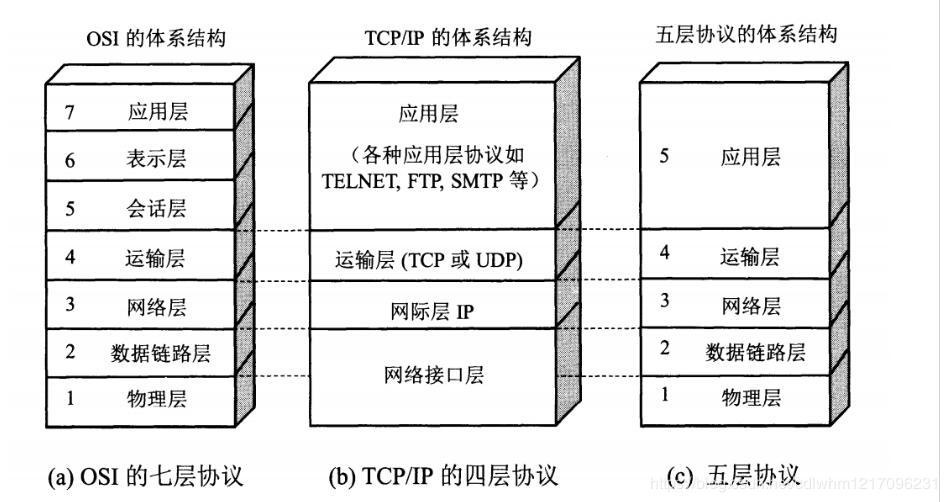

# my-resource
### 计算机网络基础知识

#### 

#### 你对计算机网络基础了解多少

#### 1、计算机网络体系结构

计算机网络体系分为3种：OSI体系结构、TCP / IP体系结构、五层体系结构

OSI（Open System Interconnect）：即开放式系统互联。一般都叫OSI参考模型，是ISO（国际标准化组织）组织在1985年研究的网络互连模型。ISO为了更好的使网络应用更为普及，推出了OSI参考模型，这样所有的公司都按照统一的标准来指定自己的网络，就可以互通互联了。

TCP / IP体系结构：其中含了一系列构成互联网基础的网络协议，是`Internet`的核心协议 & 被广泛应用于局域网 和 广域网。

#### 2、TCP/IP协议和UDP协议

###### （1）基本含义

Transmission Control Protocol，即传输控制协议。

从字面意义上讲，有人可能会认为 TCP/IP 是指 TCP 和 IP 两种协议。实际生活当中有时也确实就是指这两种协议。然而在很多情况下，它只是利用 IP 进行通信时所必须用到的协议群的统称。具体来说，IP 或 ICMP、TCP 或 UDP、TELNET 或 FTP、以及 HTTP 等都属于 TCP/IP 协议。他们与 TCP 或 IP 的关系紧密，是互联网必不可少的组成部分。TCP/IP 一词泛指这些协议，因此，有时也称 TCP/IP 为网际协议群。
互联网进行通信时，需要相应的网络协议，TCP/IP 原本就是为使用互联网而开发制定的协议族。因此，互联网的协议就是 TCP/IP，TCP/IP 就是互联网的协议。

###### （2）**数据包**

**包、帧、数据包、段、消息**
以上五个术语都用来表述数据的单位，大致区分如下：

- 包可以说是全能性术语；
- 帧用于表示数据链路层中包的单位；
- 数据包是 IP 和 UDP 等网络层以上的分层中包的单位；
- 段则表示 TCP 数据流中的信息；
- 消息是指应用协议中数据的单位。

每个分层中，都会对所发送的数据附加一个包首部，在这个首部中包含了该层必要的信息，如发送的目标地址以及协议相关信息。通常，为协议提供的信息为包首部，所要发送的内容为数据。在下一层的角度看，从上一层收到的包全部都被认为是本层的数据。

网络中传输的数据包由两部分组成：一部分是协议所要用到的首部。另一部分是上一层传过来的数据。首部的结构由协议的具体规范详细定义。在数据包的首部，明确标明了协议应该如何读取数据。反过来说，看到首部，也就能够了解该协议必要的信息以及所要处理的数据。**包首部就像协议的脸。**

###### （3）**数据处理流程**

① 应用程序处理
首先应用程序会进行编码处理，这些编码相当于 OSI 的表示层功能；
编码转化后，邮件不一定马上被发送出去，这种何时建立通信连接何时发送数据的管理功能，相当于 OSI 的会话层功能。

② TCP 模块的处理
TCP 根据应用的指示，负责建立连接、发送数据以及断开连接。TCP 提供将应用层发来的数据顺利发送至对端的可靠传输。为了实现这一功能，需要在应用层数据的前端附加一个 TCP 首部。

③ IP 模块的处理
IP 将 TCP 传过来的 TCP 首部和 TCP 数据合起来当做自己的数据，并在 TCP 首部的前端加上自己的 IP 首部。IP 包生成后，参考路由控制表决定接受此 IP 包的路由或主机。

④ 网络接口（以太网驱动）的处理
从 IP 传过来的 IP 包对于以太网来说就是数据。给这些数据附加上以太网首部并进行发送处理，生成的以太网数据包将通过物理层传输给接收端。

⑤ 网络接口（以太网驱动）的处理
主机收到以太网包后，首先从以太网包首部找到 MAC 地址判断是否为发送给自己的包，若不是则丢弃数据。
如果是发送给自己的包，则从以太网包首部中的类型确定数据类型，再传给相应的模块，如 IP、ARP 等。这里的例子则是 IP 。

⑥ IP 模块的处理
IP 模块接收到 数据后也做类似的处理。从包首部中判断此 IP 地址是否与自己的 IP 地址匹配，如果匹配则根据首部的协议类型将数据发送给对应的模块，如 TCP、UDP。这里的例子则是 TCP。
另外吗，对于有路由器的情况，接收端地址往往不是自己的地址，此时，需要借助路由控制表，在调查应该送往的主机或路由器之后再进行转发数据。

⑦ TCP 模块的处理
在 TCP 模块中，首先会计算一下校验和，判断数据是否被破坏。然后检查是否在按照序号接收数据。最后检查端口号，确定具体的应用程序。数据被完整地接收以后，会传给由端口号识别的应用程序。

⑧ 应用程序的处理
接收端应用程序会直接接收发送端发送的数据。通过解析数据，展示相应的内容。

###### （4）传输层中的TCP协议和UDP协议

- TCP 是面向连接的、可靠的流协议。流就是指不间断的数据结构，当应用程序采用 TCP 发送消息时，虽然可以保证发送的顺序，但还是犹如没有任何间隔的数据流发送给接收端。TCP 为提供可靠性传输，实行“顺序控制”或“重发控制”机制。此外还具备“流控制（流量控制）”、“拥塞控制”、提高网络利用率等众多功能。
- UDP 是不具有可靠性的数据报协议。细微的处理它会交给上层的应用去完成。在 UDP 的情况下，虽然可以确保发送消息的大小，却不能保证消息一定会到达。因此，应用有时会根据自己的需要进行重发处理。
- TCP 主要用于在传输层有必要实现可靠传输的情况
  UDP 主要用于那些对高速传输和实时性有较高要求的通信或广播通信
  TCP 和 UDP 应该根据应用的目的按需使用

 **4.1、UDP协议**

- UDP 不提供复杂的控制机制，利用 IP 提供面向无连接的通信服务。

- 将应用程序发来的数据在收到的那一刻，立即按照原样发送到网络上的一种机制。即使是出现网络拥堵的情况，UDP 也无法进行流量控制等避免网络拥塞行为。

- 不负责重发传输途中出现的丢包；包的到达顺序出现乱序时也没有纠正的功能。

- UDP 常用于几个方面：
  1、包总量较少的通信（DNS、SNMP等）
  2、视频、音频等多媒体通信（即时通信）
  3、限定于 LAN 等特定网络中的应用通信
  4、广播通信（广播、多播）。

  

**4.2、TCP协议**

- tcp实现对数据传输的各种控制。可以对丢包时重新发送；可以对乱序的分包进行顺序控制；
- TCP 作为一种面向有连接的协议，只有在确认通信对端存在时才会发送数据，从而可以控制通信流量的浪费。
- 根据 TCP 的这些机制，在 IP 这种无连接的网络上也能够实现高可靠性的通信（ 主要通过检验和、序列号、确认应答、重发控制、连接管理以及窗口控制等机制实现）。

**4.2.1、三次握手（重点）**

- TCP 提供面向有连接的通信传输。面向有连接是指在数据通信开始之前先做好两端之间的准备工作。
- 所谓三次握手是指建立一个 TCP 连接时需要客户端和服务器端总共发送三个包以确认连接的建立。在socket编程中，这一过程由客户端执行connect来触发。

- 第一次握手：客户端将标志位SYN置为1，并随机生成一个值seq = J 向服务端发送连接请求。然后客户端进入SYN_SENT状态，等待服务端确认。
- 第二次握手：服务端收到数据包后由SYN=1知道客户端请求建立连接，服务端将标志位SYN和ACK都置为1，ack=J+1，随机产生一个值seq=K，并将该数据包发送给客户端以确认连接请求，服务端进入SYN_RCVD状态。
- 第三次握手：客户端收到确认后，检查ack是否为 J+1，ACK是否为1，正确则将ACK=1，ack=K+1，发送给服务端，服务端检查ack是否为K+1，ACK是否为1，正确则连接建立成功。客户端和服务器端进入ESTABLISHED状态，完成三次握手，随后客户端与服务端之间可以开始传输数据了。

**4.2.2、四次挥手（重点）**

- 四次挥手就是终止TCP连接。即两端共发送四个包来确认连接断开。在socket编程中，这一过程由客户端或服务端任一方执行close来触发。

- 由于TCP连接是全双工的。每个一方都必须发送一个FIN来终止这一方向的连接来进行关闭。首先进行关闭的一方将执行主动关闭，而另一方则执行被动关闭。

  

- 第一次挥手：客户端发送一个FIN=M，表示自己没有数据要进行传输，单面连接传输要关闭。发送完后，客户端进入`FIN_WAIT_1`状态。如果服务端还有数据没发完，则不必急着关闭连接，可以继续发送数据。

- 第二次挥手：服务端收到FIN后，先发送ack=M+1，告诉客户端，请求我收到了，但是我还没准备好，请继续你等我的消息。这时客户端就进入FIN_WAIT_2 状态，继续等待服务器端的FIN报文。

- 第三次挥手：当服务端确定数据已发送完成，则向客户端发送FIN=N报文，告诉客户端，我这边数据发完了，准备好关闭连接了。服务端进入LAST_ACK状态。

- 第四次挥手：客户端收到FIN=N后，就知道可以关闭了，但是他还是不相信网络，怕服务器端不知道要关闭，所以发送ack=N+1后进入TIME_WAIT状态，如果服务端没有收到ACK则可以重传。服务器端收到ACK后，就知道可以断开连接了。客户端等待了2msl后依然没有收到回复，则证明服务器端已正常关闭，然后客户端也可以关闭连接了。最终完成了四次握手。

  

###### （5）网络层中的IP协议

- IP（IPv4、IPv6）相当于 OSI 参考模型中的第3层——网络层。网络层的主要作用是实现终端节点之间的通信。这种终端节点之间的通信也叫**点对点通信**。
- 网络的下一层数据链路层的主要作用是在互连同一种数据链路的节点之间进行包传递。而一旦跨越多种数据链路，就需要借助网络层。网络层可以跨越不同的数据链路，即使是在不同的数据链路上也能实现两端节点之间的数据包传输。
- **IP 大致分为三大作用模块，它们是 IP 寻址、路由（最终节点为止的转发）以及 IP 分包与组包。**

[TCP/IP详细解析传送门](https://juejin.cn/post/6844903510509633550#heading-0)

#### 3、DNS

##### 概念

**域名系统(Domain Name System)**，**域名系统是因特网上作为域名和IP地址相互映射的一个分布式数据库，能让用户更方便使用互联网**。

域名的来由：我们可以通过IP地址去访问网站，但是对大多数用户来说，访问每个网站都需要记住一串数字是不现实的，所以用户可以通过域名来访问网站。**总结一点就是IP地址是面向主机的，而域名则是面向用户的**。

互联网都是通过URL来请求资源的，而URL中的域名需要解析成IP地址才能与远程主机建立连接，如何将域名解析成IP地址就属于DNS解析的工作范畴

##### DNS安全问题：

- DNS劫持：指用户访问一个被标记的地址时，DNS服务器故意将此地址指向一个错误的IP地址的行为。例：收到各种推送广告等网站

- DNS污染：指的是用户访问一个地址，国内的服务器(非DNS)监控到用户访问的已经被标记地址时，服务器伪装成DNS服务器向用户发回错误的地址的行为。比如不能访问Google、YouTube等。

- dns污染与dns劫持的区别在于，dns劫持修改了dns的解析结果，dns污染是不经过dns服务器，返回错误信息

- DDOS攻击可能造成域名解析瘫痪

##### DNS优化：

- DNS Prefetching：用户在请求某个链接之前，浏览器先尝试解析该链接的域名再将其进行缓存。这样真正请求的时候就不需要进行DNS解析。

- 域名收敛：建议将静态资源只放在一个域名下面，可以有效减少dns的请求

- httpdns：基于Http协议向HTTPDNS服务器发送域名解析请求，替代了基于DNS协议向运营商Local DNS发起解析请求的传统方式，可以避免运营商的域名劫持和进行精准调度。

#### 4、CDN

**内容分发网络（Content Delivery Network）**，它能够实时地根据网络流量和各节点的连接、负载状况以及到用户的距离和响应时间等综合信息将用户的请求重新导向离用户最近的服务节点上。其目的是使用户可就近取得所需内容，解决 Internet网络拥挤的状况，提高用户访问网站的响应速度。

CDN系统由三部分组成

- 分发服务系统：最基本的工作单元就是Cache设备，cache（边缘cache）负责直接响应最终用户的访问请求，把缓存在本地的内容快速地提供给用 户。同时cache还负责与源站点进行内容同步，把更新的内容以及本地没有的内容从源站点获取并保存在本地。Cache设备的数量、规模、总服务能力是衡 量一个CDN系统服务能力的最基本的指标

- 负载均衡系统：主要功能是负责对所有发起服务请求的用户进行访问调度，确定提供给用户的最终实际访问地址。两级调度体系分为全局负载均衡（GSLB）和本 地负载均衡（SLB）。GSLB主要根据用户就近性原则，通过对每个服务节点进行“最优”判断，确定向用户提供服务的cache的物理位置。SLB主要负 责节点内部的设备负载均衡

- 运营管理系统：分为运营管理和网络管理子系统，负责处理业务层面的与外界系统交互所必须的收集、整理、交付工作，包含客户管理、产品管理、计费管理、统计分析等功能。

  

使用csd和没使用过程：

使用CDN的方法很简单，只需要修改自己的DNS解析，设置一个CNAME指向CDN服务商即可。

未使用CDN缓存资源的过程为:

1. 浏览器通过前面提到的过程对域名进行解析，以得到此域名对应的IP地址；

2. 浏览器使用所得到的IP地址，向域名的服务主机发出数据访问请求；

3. 服务器向浏览器返回响应数据

   

使用CDN后：

1. 点击后经过本地DNS系统解析，DNS系统会最终将域名的解析权交给CNAME指向的CDN专用DNS服务器。
2. CDN的DNS服务器将CDN的全局负载均衡设备IP地址返回用户。用户向CDN的全局负载均衡发起URL访问请求，全局负载均衡并选一台用户所属区域的区域负载均衡设备告诉用户向他请求。
3. 区域负载均衡会选一台合适的缓存服务器提供服务，并向全局设备返回缓存服务器IP，全局把这个IP返给用户。
4. 用户向缓存服务器发起请求。如果这台缓存服务器上没用户想要的内容，则会一直向上级请求，直至追溯到源服务器将内容拉到本地。

CDN的优点

1. 本地Cache加速，加快访问速度

2. 镜像服务，消除运营商之间互联的瓶颈影响，保证不同网络的用户都能得到良好的访问质量

3. 远程加速，自动选择cache服务器

4. 带宽优化，分担网络流量，减轻压力，

5. 集群抗攻击

6. 节约成本

   

#### 5、HTTP和HTTPS协议

##### 5.1 HTTP协议

HTTP（HyperText Transfer Protocol，超文本传输协议）是一个基于请求与响应，无状态的，应用层的协议，常基于TCP/IP协议传输数据，互联网上应用最为广泛的一种网络协议,所有的WWW（万维网）文件都必须遵守这个标准。设计HTTP的初衷是为了提供一种发布和接收HTML页面的方法。

###### http发展历史

**http**连接分为短连接和长连接：

短连接 是每次请求都要重新建立TCP链接，TCP又要三次握手才能建立，然后发送自己的信息。即每一个request对应一个response。

长连接 是在一定的期限内保持TCP连接不断开。客户端与服务器通信，必须要由客户端发起然后服务器返回结果。客户端是主动的，服务器是被动的。

多路复用：通过单一的HTTP/2连接请求发起多重的请求-响应消息，多个请求stream共享一个TCP连接，实现多留并行而不是依赖建立多个TCP连接。

###### HTTP 特征

1、简单快速：客户向服务器请求服务时，只需传送请求方法和路径。

2、灵活：HTTP 允许传输任意类型的数据对象。正在传输的类型由 Content-Type 加以标记。

3、无连接：限制每次连接只处理一个请求。服务器处理完客户的请求，并收到客户的应答后，即断开连接。

4、无状态：是指协议对于事务处理没有记忆能力。缺少状态时后续处理需要前面的信息，则必须重新传。

HTTP 优缺点

优点：简单灵活易扩展；无状态

缺点：

无状态

明文传输：通信使用明文、请求和响应不会对通信方进行确认、无法保护数据的完整性

队头阻塞（性能）问题

###### HTTP 的请求方式

GET：获取资源；向特定的资源发出请求，并返回内容。

POST：传输实体主体；向指定资源提交数据进行处理请求（例如提交表单或者上传文件）

OPTIONS：询问支持的方法；允许客户端查看服务器的性能；预检请求，还用来检查访问权限

HEAD：获得报文头部；类似于get请求，只不过返回的响应中没有具体的内容，用于获取报头，确认URI的有效性及资源更新的日期事件等。

PUT：传输文件；从客户端向服务器传送的数据取代指定的文件的内容（更新数据）

DELETE：删除文件；请求服务器删除指定的文件。与PUT相反的方法

TRACE：追踪路径；回显服务器收到的请求，主要用于测试或诊断

CONNECT：要求用隧道协议连接代理；HTTP1.1协议中预留给能够将连接方式改为管道方式的代理服务器

###### http状态码

1开头：服务器收到请求，需要请求者继续执行操作

2开头：请求成功，操作被成功接收并处理

3开头： 请求被重定向，需要进一步的操作以完成请求

4开头：客户端请求出错，请求包含语法错误或无法完成请求

5开头：服务器处理请求出错

###### HTTP请求头

分为四种： `通用标头`、`请求标头`、`响应标头` 和 `实体标头`

###### HTTP缓存机制

1.强缓存

缓存规则信息包含在header中，而强缓存的规则通常由Expires和Cache-Control这两个字段标明

2.协商缓存

与强制缓存不同的是，协商缓存每次进行再请求时，需要先向服务器查询该缓存是否可用，如果缓存可用，则返回304状态码，通知客户端可以使用缓存，否则响应整片资源内容。协商缓存有这几个字段来标识缓存规则:Last-Modified / If-Modified-Since 、Etag / If-None-Match

##### 5.2 HTTPS协议

超文本传输安全协议（Hypertext Transfer Protocol Secure）。是一种通过计算机网络进行安全通信的传输协议。HTTPS经由HTTP进行通信，但利用SSL/TLS来加密数据包。主要目的是提供对网站服务器的身份认证，保护交换数据的隐私和完整性。

优缺点：

优点：身份认证（防止伪装客户端）；内容加密（截获和窃听）；一致性校验（防篡改）

缺点：速度慢；成本高；缓存不如http好

##### 5.3 HTTP 1.0和HTTP 1.1的区别

1. **连接方面：**http1.0 默认使用非持久连接，而 http1.1 默认使用持久连接。http1.1 通过使用持久连接来使多个 http 请求复用同一个 TCP 连接，以此来避免使用非持久连接时每次需要建立连接的时延。
2. **资源请求方面：**在 http1.0 中，存在一些浪费带宽的现象，例如客户端只是需要某个对象的一部分，而服务器却将整个对象送过来了，并且不支持断点续传功能，http1.1 则在请求头引入了 range 头域，它允许只请求资源的某个部分，即返回码是 206（Partial Content），这样就方便了开发者自由的选择以便于充分利用带宽和连接。
3. **缓存方面：**在 http1.0 中主要使用 header 里的 If-Modified-Since、Expires 来做为缓存判断的标准，http1.1 则引入了更多的缓存控制策略，例如 Etag、If-Unmodified-Since、If-Match、If-None-Match 等更多可供选择的缓存头来控制缓存策略。
4. http1.1 中**新增了 host 字段**，用来指定服务器的域名。http1.0 中认为每台服务器都绑定一个唯一的 IP 地址，因此，请求消息中的 URL 并没有传递主机名（hostname）。但随着虚拟主机技术的发展，在一台物理服务器上可以存在多个虚拟主机，并且它们共享一个IP地址。因此有了 host 字段，这样就可以将请求发往到同一台服务器上的不同网站。
5. http1.1 相对于 http1.0 还新增了很多**请求方法**，如 PUT、HEAD、OPTIONS 等。

##### 5.4 HTTP 1.1和HTTP 2.0的区别

1. **二进制协议：**HTTP/2 是一个二进制协议。在 HTTP/1.1 版中，报文的头信息必须是文本（ASCII 编码），数据体可以是文本，也可以是二进制。HTTP/2 则是一个彻底的二进制协议，头信息和数据体都是二进制，并且统称为"帧"，可以分为头信息帧和数据帧。 帧的概念是它实现多路复用的基础。
2. **多路复用：**HTTP/2 实现了多路复用，HTTP/2 仍然复用 TCP 连接，但是在一个连接里，客户端和服务器都可以同时发送多个请求或回应，而且不用按照顺序一一发送，这样就避免了"队头堵塞"【1】的问题。
3. **数据流：**HTTP/2 使用了数据流的概念，因为 HTTP/2 的数据包是不按顺序发送的，同一个连接里面连续的数据包，可能属于不同的请求。因此，必须要对数据包做标记，指出它属于哪个请求。HTTP/2 将每个请求或回应的所有数据包，称为一个数据流。每个数据流都有一个独一无二的编号。数据包发送时，都必须标记数据流 ID ，用来区分它属于哪个数据流。
4. **头信息压缩：**HTTP/2 实现了头信息压缩，由于 HTTP 1.1 协议不带状态，每次请求都必须附上所有信息。所以，请求的很多字段都是重复的，比如 Cookie 和 User Agent ，一模一样的内容，每次请求都必须附带，这会浪费很多带宽，也影响速度。HTTP/2 对这一点做了优化，引入了头信息压缩机制。一方面，头信息使用 gzip 或 compress 压缩后再发送；另一方面，客户端和服务器同时维护一张头信息表，所有字段都会存入这个表，生成一个索引号，以后就不发送同样字段了，只发送索引号，这样就能提高速度了。
5. **服务器推送：**HTTP/2 允许服务器未经请求，主动向客户端发送资源，这叫做服务器推送。使用服务器推送提前给客户端推送必要的资源，这样就可以相对减少一些延迟时间。这里需要注意的是 http2 下服务器主动推送的是静态资源，和 WebSocket 以及使用 SSE 等方式向客户端发送即时数据的推送是不同的。

**【1】队头堵塞：**

> 队头阻塞是由 HTTP 基本的“请求 - 应答”模型所导致的。HTTP 规定报文必须是“一发一收”，这就形成了一个先进先出的“串行”队列。队列里的请求是没有优先级的，只有入队的先后顺序，排在最前面的请求会被最优先处理。如果队首的请求因为处理的太慢耽误了时间，那么队列里后面的所有请求也不得不跟着一起等待，结果就是其他的请求承担了不应有的时间成本，造成了队头堵塞的现象。

##### 5.5 HTTP 3.0

##### 5.6 HTTP和HTTPS区别

HTTPS就是从HTTP加上加密处理（一般是SSL安全通信线路）+认证+完整性保护

1. HTTPS协议需要CA证书，费用较高；而HTTP协议不需要；
2. 使用不同的连接方式，端口也不同，http是80，https443
3. http是超文本传输协议，信息是明文传输，https则是具有安全性的ssl加密传输协议。
4. http和https的连接方式不同。http的连接很简单，是无状态的；HTTPS协议是由SSL+HTTP协议构建的可进行加密传输、身份认证的网络协议，比http协议安全。

#### 6、ARP/RARP协议

- 只要确定了 IP 地址，就可以向这个目标地址发送 IP 数据报。然而，在底层数据链路层，进行实际通信时却有必要了解每个 IP 地址所对应的 MAC 地址。

- ARP 是一种解决地址问题的协议。以目标 IP 地址为线索，用来定位下一个应该接收数据分包的网络设备对应的 MAC 地址。不过 ARP 只适用于 IPv4，不能用于 IPv6。IPv6 中可以用 ICMPv6 替代 ARP 发送邻居探索消息。

- RARP 是将 ARP 反过来，从 MAC 地址定位 IP 地址的一种协议。

#### 7、NAT协议

- NAT（Network Address Translator）是用于在本地网络中使用私有地址，在连接互联网时转而使用全局 IP 地址的技术。

- 除转换 IP 地址外，还出现了可以转换 TCP、UDP 端口号的 NAPT（Network Address Ports Translator）技术，由此可以实现用一个全局 IP 地址与多个主机的通信。

- NAT（NAPT）实际上是为正在面临地址枯竭的 IPv4 而开发的技术。不过，在 IPv6 中为了提高网络安全也在使用 NAT，在 IPv4 和 IPv6 之间的相互通信当中常常使用 NAT-PT。

#### 8、DHCP协议

- 如果逐一为每一台主机设置 IP 地址会是非常繁琐的事情。特别是在移动使用笔记本电脑、只能终端以及平板电脑等设备时，每移动到一个新的地方，都要重新设置 IP 地址。

- 于是，为了实现自动设置 IP 地址、统一管理 IP 地址分配，就产生了 DHCP（Dynamic Host Configuration Protocol）协议。有了 DHCP，计算机只要连接到网络，就可以进行 TCP/IP 通信。也就是说，DHCP 让即插即用变得可能。

- DHCP 不仅在 IPv4 中，在 IPv6 中也可以使用。

#### 9、Socket

Socket并不是协议，而是为了使用TCP和UDP而抽离出来的一层API。位于应用层与传输层之间的抽象层。是对 TCP/IP 协议族的封装。它是网络环境中进程间通信的API(应用程序编程接口)

​		

可以看成是两个网络应用程序进行通信时，各自的通信连接中的**端点**。

socket是“open—write/read—close”模式的一种实现。

先从服务器端说起。服务器端先初始化Socket，然后与端口绑定(bind)，对端口进行监听(listen)，调用accept阻塞，等待客户端连接。在这时如果有个客户端初始化一个Socket，然后连接服务器(connect)，如果连接成功，这时客户端与服务器端的连接就建立了。客户端发送数据请求，服务器端接收请求并处理请求，然后把回应数据发送给客户端，客户端读取数据，最后关闭连接，一次交互结束。

网络中进程之间如何通信？首要解决的问题是如何唯一标识一个进程，其实TCP/IP协议族已经帮我们解决了这个问题，网络层的“ip地址”可以唯一标识网络中的主机，而传输层的“协议+端口”可以唯一标识主机中的应用程序（进程）。利用（ip地址，协议，端口）就可以标识网络的进程了，网络中的进程通信就可以利用这个标志与其它进程进行交互。

#### 10、WebSocket

ajax轮询、long poll是非常消耗资源的，因此就出现了websocket，即时通讯，替代轮询。

ajax轮询的原理非常简单，让浏览器隔个几秒就发送一次请求，询问服务器是否有新信息。需要服务器有很快的处理速度和资源。
long poll原理跟 ajax轮询差不多。不过采取的是阻塞模型，，也就是说，客户端发起连接后，如果没消息，就一直不返回Response给客户端。直到有消息才返回，返回完之后，客户端再次建立连接，周而复始。需要有很高的并发，也就是说同时接待客户的能力（需要更多服务器）。

WebSocket是HTML5规范中的一种新的网络协议，和http协议一样属于应用层协议，实现了浏览器和服务器之间的双向通信。只需要浏览器与服务器进行一次http请求建立了TCP连接之后就**持久性连接**，即可进行双向的数据传送与接收。

解决了http单向性问题；http建立连接的延迟耗时；资源的消耗；流量的浪费。

WebSocket在用于双向传输、推送消息方面能够做到灵活、简便、高效，但在普通的Request-Response过程中并没有太大用武之地，比起普通的HTTP请求来反倒麻烦了许多，甚至更为低效。

#### webSocket和http区别

相同点：

1、都基于TCP应用层协议，通过TCP来传输数据

2、在连接的建立过程中对错误的处理方式相同

3、都使用Request/Response模型进行连接的建立

不同点：

1、webSocket是双向通信协议；而http是单向。

2、webSocket需要浏览器和服务器握手建立连接；而http是浏览器向服务器发起连接

#### websocket和Ajax的区别

首先了解ajax是什么

Ajax，即异步JavaScript和XML，是一种创建交互式网页应用的网页开发技术。通过在后台与服务器进行少量数据交换，Ajax可以使网页实现异步更新，这意味着可以在不重新加载整个网页的情况下，对网页的部分进行加载更新。

Ajax 的优点在于它在浏览器与web服务器之间使用异步数据传输（HTTP请求），不阻塞用户，核心对象是XMLHTTPRequest。通过这个对象， js可在不重新加载页面的情况下与web服务器交换数据 。

相同点：实现浏览器与服务器的实时数据交互，可以通过建立websocket，也可以通过Ajax轮询的方式。

应用场景：

websocket一般用于社交类和股票基金类应用。达到数据实时更新。

Ajax的特点在于异步交互，动态更新web页面。一般会应用在交互较多，频繁读取数据的web应用中。

#### http和Socket区别

http连接就是所谓的短连接，及客户端向服务器发送一次请求，服务器端相应后连接即会断掉。

socket连接及所谓的长连接，理论上客户端和服务端一旦建立连接，则不会主动断掉；但是由于各种环境网络因素可能会是连接断开，

#### webSocket和Socket区别

webSocket是协议；socket并不是协议，是传输控制层接口；

#### 网络安全

XSS 跨站脚本攻击

SQL 注入攻击

OS 命令注入攻击

DDOS 攻击

csrf  xsrs 

#### 什么是WS/WSS？

##### 概念

WS是HTML5一种新的协议，它实现了浏览器与服务器全双工（full-duplex）通信，能更好地节省服务器资源和带宽并达到实时通讯。WS建立在TCP之上，同HTTP一样通过TCP来传输数据，但是它和HTTP最大不同是：

WS是一种双向通信协议，在建立连接后，WS服务器和Browser/Client Agent都能主动地向对方发送或接收数据，就像Socket一样；WS需要类似TCP的客户端和服务器端通过握手连接，连接成功后才能相互通信。

WSS是WS的加密版本。

##### 为何使用WS/WSS？

很多应用要求服务端有能力进行实时推送（例如直播间聊天室），以往很多网站为了实现推送技术，所用的技术都是轮询。轮询是在特定的时间间隔（如每1秒），由浏览器对服务器发出HTTP请求，然后由服务器返回最新的数据给客户端的浏览器。这种传统的模式带来很明显的缺点，即浏览器需要不断地向服务器发出请求，然而HTTP请求可能包含较长的头部，其中真正有效的数据可能只是很小的一部分，显然这样会浪费很多的带宽资源。

在这种情况下，HTML5定义了WS协议，能更好地节省服务器资源和带宽，并且能够更实时地进行通讯。WS实现了浏览器与服务器全双工通信，允许服务器主动发送信息给客户端。

#### 在浏览器输入地址按回车发生了什么？

简单来说：用户在浏览器中输入网址确认后发起请求，首先浏览器会检查缓存（系统缓存如hosts文件；本地dns服务器缓存）中有没该域名，有就返回IP，没就继续向根域名解析服务器（RDNS）发起域名解析的请求，直到找到IP并向浏览器返回响应数据，并进行缓存。

（1）**解析URL：**首先会对 URL 进行解析，分析所需要使用的传输协议和请求的资源的路径。如果输入的 URL 中的协议或者主机名不合法，将会把地址栏中输入的内容传递给搜索引擎。如果没有问题，浏览器会检查 URL 中是否出现了非法字符，如果存在非法字符，则对非法字符进行转义后再进行下一过程。

（2）**缓存判断：**浏览器会判断所请求的资源是否在缓存里，如果请求的资源在缓存里并且没有失效，那么就直接使用，否则向服务器发起新的请求。

（3）**DNS解析：**下一步首先需要获取的是输入的 URL 中的域名的 IP 地址，首先会判断本地是否有该域名的 IP 地址的缓存，如果有则使用，如果没有则向本地 DNS 服务器发起请求。本地 DNS 服务器也会先检查是否存在缓存，如果没有就会先向根域名服务器发起请求，获得负责的顶级域名服务器的地址后，再向顶级域名服务器请求，然后获得负责的权威域名服务器的地址后，再向权威域名服务器发起请求，最终获得域名的 IP 地址后，本地 DNS 服务器再将这个 IP 地址返回给请求的用户。用户向本地 DNS 服务器发起请求属于递归请求，本地 DNS 服务器向各级域名服务器发起请求属于迭代请求。

（4）**获取MAC地址：**当浏览器得到 IP 地址后，数据传输还需要知道目的主机 MAC 地址，因为应用层下发数据给传输层，TCP 协议会指定源端口号和目的端口号，然后下发给网络层。网络层会将本机地址作为源地址，获取的 IP 地址作为目的地址。然后将下发给数据链路层，数据链路层的发送需要加入通信双方的 MAC 地址，本机的 MAC 地址作为源 MAC 地址，目的 MAC 地址需要分情况处理。通过将 IP 地址与本机的子网掩码相与，可以判断是否与请求主机在同一个子网里，如果在同一个子网里，可以使用 APR 协议获取到目的主机的 MAC 地址，如果不在一个子网里，那么请求应该转发给网关，由它代为转发，此时同样可以通过 ARP 协议来获取网关的 MAC 地址，此时目的主机的 MAC 地址应该为网关的地址。

（5）**TCP三次握手：**下面是 TCP 建立连接的三次握手的过程，首先客户端向服务器发送一个 SYN 连接请求报文段和一个随机序号，服务端接收到请求后向客户端发送一个 SYN ACK报文段，确认连接请求，并且也向客户端发送一个随机序号。客户端接收服务器的确认应答后，进入连接建立的状态，同时向服务器也发送一个ACK 确认报文段，服务器端接收到确认后，也进入连接建立状态，此时双方的连接就建立起来了。

（6）**HTTPS握手：**如果使用的是 HTTPS 协议，在通信前还存在 TLS 的一个四次握手的过程。首先由客户端向服务器端发送使用的协议的版本号、一个随机数和可以使用的加密方法。服务器端收到后，确认加密的方法，也向客户端发送一个随机数和自己的数字证书。客户端收到后，首先检查数字证书是否有效，如果有效，则再生成一个随机数，并使用证书中的公钥对随机数加密，然后发送给服务器端，并且还会提供一个前面所有内容的 hash 值供服务器端检验。服务器端接收后，使用自己的私钥对数据解密，同时向客户端发送一个前面所有内容的 hash 值供客户端检验。这个时候双方都有了三个随机数，按照之前所约定的加密方法，使用这三个随机数生成一把秘钥，以后双方通信前，就使用这个秘钥对数据进行加密后再传输。

（7）**返回数据：**当页面请求发送到服务器端后，服务器端会返回一个 html 文件作为响应，浏览器接收到响应后，开始对 html 文件进行解析，开始页面的渲染过程。

（8）**页面渲染：**浏览器首先会根据 html 文件构建 DOM 树，根据解析到的 css 文件构建 CSSOM 树，如果遇到 script 标签，则判端是否含有 defer 或者 async 属性，要不然 script 的加载和执行会造成页面的渲染的阻塞。当 DOM 树和 CSSOM 树建立好后，根据它们来构建渲染树。渲染树构建好后，会根据渲染树来进行布局。布局完成后，最后使用浏览器的 UI 接口对页面进行绘制。这个时候整个页面就显示出来了。

（9）**TCP四次挥手：**最后一步是 TCP 断开连接的四次挥手过程。若客户端认为数据发送完成，则它需要向服务端发送连接释放请求。服务端收到连接释放请求后，会告诉应用层要释放 TCP 链接。然后会发送 ACK 包，并进入 CLOSE_WAIT 状态，此时表明客户端到服务端的连接已经释放，不再接收客户端发的数据了。但是因为 TCP 连接是双向的，所以服务端仍旧可以发送数据给客户端。服务端如果此时还有没发完的数据会继续发送，完毕后会向客户端发送连接释放请求，然后服务端便进入 LAST-ACK 状态。客户端收到释放请求后，向服务端发送确认应答，此时客户端进入 TIME-WAIT 状态。该状态会持续 2MSL（最大段生存期，指报文段在网络中生存的时间，超时会被抛弃） 时间，若该时间段内没有服务端的重发请求的话，就进入 CLOSED 状态。当服务端收到确认应答后，也便进入 CLOSED 状态。

#### get和post区别

1、场景：get请求对服务器资源不产生影响；post产生影响；

2、是否缓存：浏览器一般会对get请求缓存，很少对post缓存

3、发送报文格式：get请求的报文中实体部分为空；post一般向服务器发送数据

4、安全性：get请求参数是放在url中，相对post不安全，因为请求的url会保存在历史记录中

5、请求长度：游览器由于对url长度的限制，所以会影响get请求的长度

6、参数类型：post的参数支持更多的数据类型

