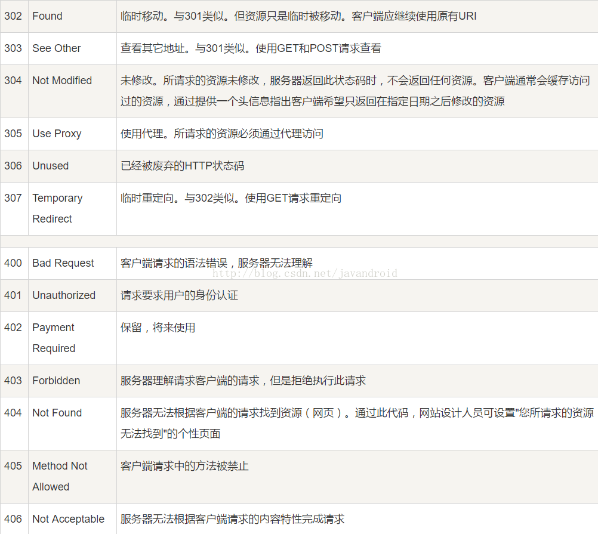
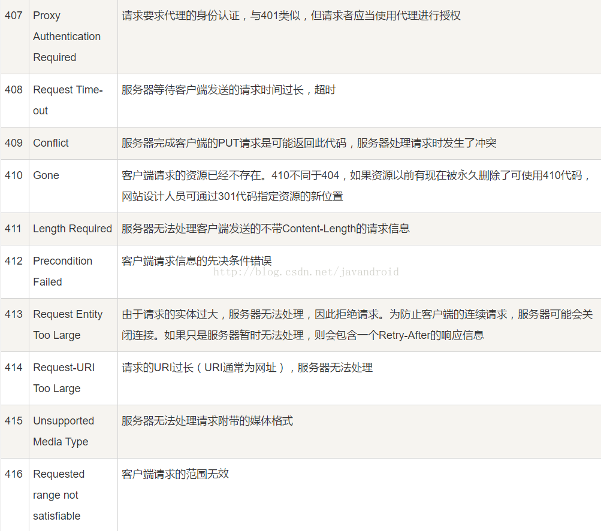
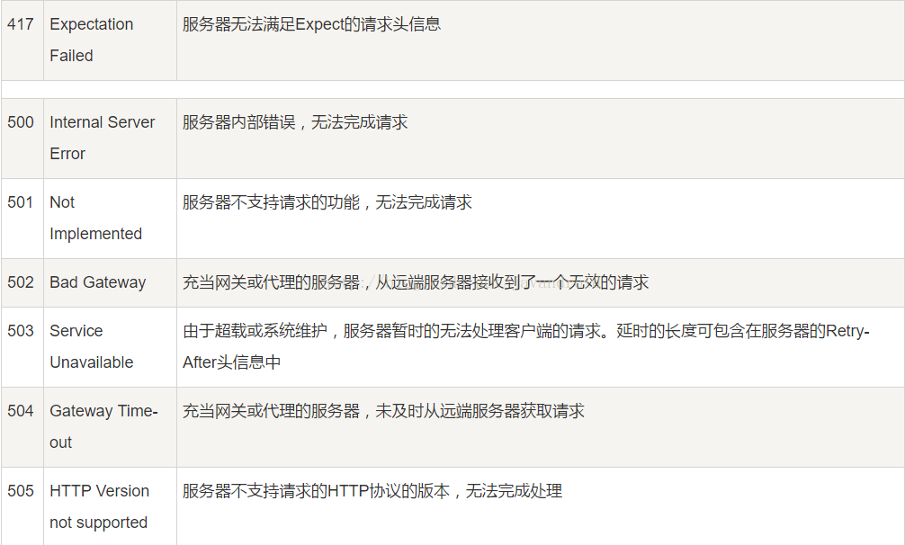

页面和服务器交互最常见的方式就是ajax，ajax简单来说就是浏览器发送http请求到服务端，然后服务端响应并返回数据，常见的请求头和响应头如下图所示。

### General 通用信息包含什么

1. **Request URL：**请求的url路径

2. **Request Method：**请求方式

3. **Status Code：**状态码

4. **Remote Address：**远程地址

5. **Referrer Policy：**当一个用户点击当前页面中的一个链接，然后跳转到目标页面时，目标页面会收到一个信息，即用户是从哪个源链接跳转过来的

   

### 请求头Request Headers 包含什么

1. **Accept：**指定客户端能够接收哪些内容类型
2. **Accept-Encoding：**指浏览器可以支持web服务器返回内容的压缩编码类型。表示允许服务器发送内容到浏览器之前进行压缩
3. **Accept-Language：**指浏览器用来展示返回信息所优先选择的语言
4. **Connection：**表示是否需要持久连接（HTTP 1.1默认进行持久连接）
5. **Connec-Length：**请求头的长度
6. **Content-Type：**显示此Http请求提交得内容类型
7. **cookie ：** 浏览器端cookie
8. **Hose ：** 客户端地址
9. **Origin：**目标地址
10. **Referer ：** 包含一个URL，用户从该URL代表的页面出发访问当前请求的页面
11. **User-Agent ：** 客户端信息
12. **x－Requested-With：**是否为同步请求，如果为XMLHttpRequest，则为 Ajax 异步请求。如果为null则为传统同步请求

### 响应头Response Headers 包含什么

1. **Allow：**对某网络资源的有效请求行为（比如支持GET，POST等），不允许则返回405
2. **Access-Control-Allow-Origin：**指定哪些网站可以跨域资源共享。解决跨域的一种方法
3. **Accept-Ranges：**表示服务器是否支持指定范围请求及哪种类型的分段请求
4. **Cache-Control：**告诉所以的缓存机制是否可以缓存，以及可以缓存那种类型
5. **Content-Encoding：**web服务器支持的返回内容压缩编码类型
6. **Content-Language：**服务端发送的语言类型（如 zh-cn）
7. **Content-Length：**响应内容的长度。只有当浏览器使用持久HTTP连接时才需要这个数据
8. Content-Location：请求资源可替代的备用的另一地址
9. Content-MD5：返回资源的MD5校验值
10. Content-Range：在整个返回体中本部分的字节位置
11. **Content-Type：**返回内容的MIME类型
12. **Connection：**浏览器与服务器之间连接的类型。（如Keep-Alive）
13. **Date：**当前服务器消息发出的时间
14. ETag：请求变量的实体标签的当前值
15. **Expires：**响应过期的日期和时间。应该在什么时候认为文档已经过期，从而不再缓存它
16. **Last-Modified：**请求资源的最后修改时间
17. **Location：**用来重定向接收方到非请求URL的位置来完成请求或标识新的资源。表示客户应当到哪里去提取文档。Location通常不是直接设置的，而是通过HttpServletResponse的sendRedirect方法，该方法同时设置状态代码为302。
18. Pragma：包括实现特定的指令，它可应用到响应链上的任何接收方
19. Proxy-Authenticate：它指出认证方案和可应用到代理的该URL上的参数
20. **refresh：**应用于重定向或一个新的资源被创造，在5秒之后重定向。表示浏览器应该在多少时间之后刷新文档，以秒计
21. **Server：**web服务器软件名称
22. **Set-Cookie：**设置Http Cookie
23. Trailer：指出头域在分块传输编码的尾部存在
24. Transfer-Encoding：文件传输编码
25. Via：告知代理客户端响应是通过哪里发送的
26. WWW-Authenticate：表明客户端请求实体应该使用什么类型的授权信息

### HTTP状态码

当浏览者访问一个网页时，浏览者的浏览器会向网页所在服务器发出请求。当浏览器接收并显示网页前，此网页所在的服务器会返回一个包含HTTP状态码的信息头（server header）用以响应浏览器的请求。
HTTP状态码的英文为HTTP Status Code。状态代码由三位数字组成，第一个数字定义了响应的类别，且有五种可能取值。

- 1xx：指示信息--表示请求已接收，请求者要继续执行操作。
- 2xx：成功--表示请求已被成功接收并处理。
- 3xx：重定向--需要进一步的操作以完成请求。
- 4xx：客户端错误--请求有语法错误或请求无法实现。
- 5xx：服务器错误--服务器在处理请求过程中发生错误

**常见的状态码如下：**

- 100：请求者应当继续提出请求。 服务器返回此代码表示已收到请求的第一部分，正在等待其余部分。
- 200 OK：客户端请求成功。
- 204 No Content：无内容，服务器成功处理，但未返回内容。
- 302 Moved Permanently：临时移动，客户端使用原有缓存
- 308 Permanent Redirect 和 301 都是永久重定向
- 400 Bad Request：客户端请求有语法错误，不能被服务器所理解。
- 401 Unauthorized：请求未经授权，这个状态代码必须和WWW-Authenticate报头域一起使用。
- 403 Forbidden：服务器收到请求，但是拒绝提供服务。
- 404 Not Found：请求资源不存在，例：输入了错误的URL。
- 500 Internal Server Error：服务器发生不可预期的错误。
- 503 Server Unavailable：服务器当前不能处理客户端的请求，一段时间后可能恢复正常，例：HTTP/1.1 200 OK（CRLF）。

