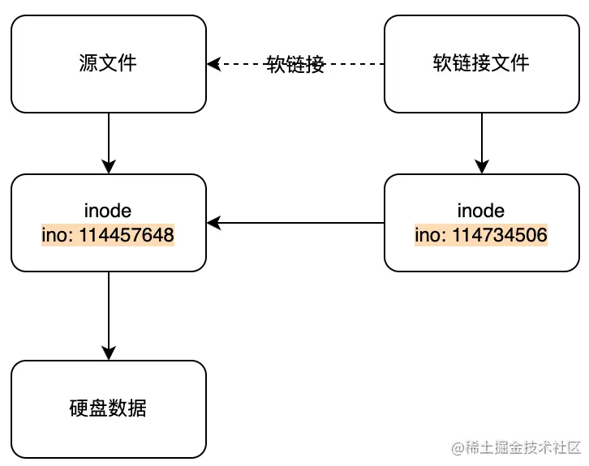
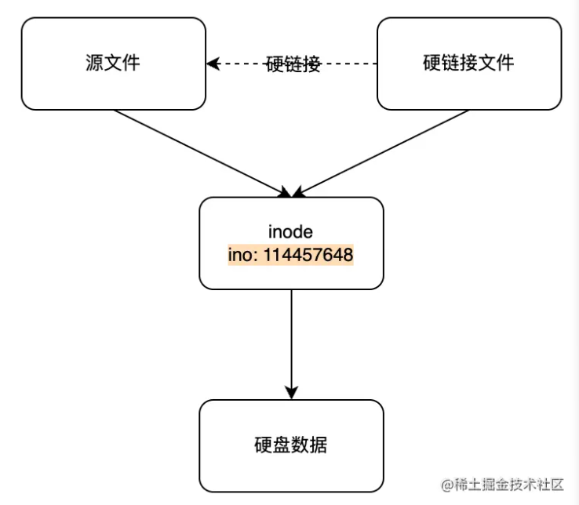

### npm

中文文档：https://www.npmjs.cn/ 	英文：https://docs.npmjs.com/

详细：https://mp.weixin.qq.com/s/sRhuMQ3f6vjUkabUy_dEYQ


**一、概念**

可以理解为包管理工具。通过 npm 可以安装、共享、发布，管理项目依赖关系。

**早期的npm存在的问题：**

1、下载速度很慢；

2、依赖关系层级很深，也导致项目体积很大、包的重复安装；

3、版本的不确定性，会导致一些难以调试的bug


国内直接使用 npm 的官方镜像安装是非常慢的，可以使用淘宝NPM 镜像。淘宝 NPM 镜像是一个完整 npmjs.org 镜像，你可以用此代替官方版本(只读)，同步频率目前为 **10分钟** 一次以保证尽量与官方服务同步。

> 注意 cnpm 不支持 package-lock
>
> 使用 `cnpm install` 时候，并不会生成 `package-lock.json` 文件。`cnpm install` 的时候，就算你项目中有 `package-lock.json` 文件，`cnpm` 也不会识别，仍会根据 `package.json` 来进行安装

```
//	先安装淘宝镜像
npm install -g cnpm --registry=https://registry.npmmirror.com

// 然后就可以使用 cnpm 替代 npm 来安装
cnpm install '包名'
```


**二、package.json常见属性**

- dependencies（生产环境）和 devDependencies（开发环境）


dependencies 里面的依赖包在生产环境和开发环境都是有效的

而 devDependencies 里面的依赖包只开发环境有效，主要是存放用于本地开发的

```
// 安装到 devDependencies
npm install '包名' --save-dev
// 简写
npm i '包名' -D

// 安装到 dependencies
npm install '包名' --save
// 简写
npm i '包名' -S
```

npm 5.x开始，可以不用添加-S/--save，已经默认了添加到dependencies中


- **scripts：** 

`npm` 允许使用 `scripts` 字段定义脚本命令。

`scripts` 对象中的每个属性对应一段脚本。通过运行 key值 就执行了 value 里面的脚本命令

支持通配符、**变量**、钩子、外部传参、支持并发 & 异步执行等等

其中test和start属于特殊命令可以省略 run 

详细参考：http://www.ruanyifeng.com/blog/2016/10/npm_scripts.html


**三、版本号**

`npm view package version` 查看某个 `package` 的最新版本

`npm view package versions` 查看某个 `package` 在npm服务器上所有发布过的版本

`npm ls` 可查看当前仓库依赖树上所有包的版本信息


通常版本号格式是  X.Y.Z `  ，X代表主版本号，Y代表次版本号，Z代表修订版本号

1. 主版本号(`major`)：当你做了不兼容的API 修改
2. 次版本号(`minor`)：当你做了向下兼容的功能性新增
3. 修订号(`patch`)：当你做了向下兼容的问题修正。

```
例子：
"dependencies": {
	"名": "1.1.0",  =》 固定版本号
	"名": "*",  =》 任意版本号（ 大于等于 0.0.0 ）
	"名": "2.x",  =》 匹配主要版本号内 （ 大于等于 2.0.0 且 小于 3.0.0 ）
	"名": "~3.2.1",  =》 当安装依赖时获取到有新版本时，主和次版本号不变的情况下，保持修订版本号为最新版本
	"名": "^4.1.5",  =》 当安装依赖时获取到有新版本时，主版本号不变的情况下，保持次和修订版本号为最新版本
	"名": "1.1.0",  =》 固定版本号
}
```


**四、package-lock.json**

实际开发中，经常会因为不同开发者不同的环境导致各种依赖不一致而产生奇怪或难以解决的问题，或者在某些场景下，我们不希望依赖被更新，建议在开发中使用 `package-lock.json`。

锁定依赖版本意味着在我们不手动执行更新的情况下，每次安装依赖都会安装固定版本。保证整个团队使用版本号一致的依赖。解决了依赖不一产生奇怪的问题和依赖树模块版本存在的不确定性

> 使用 package-lock.json 要确保npm的版本在5.6以上，因为在5.0 - 5.6中间，对 package-lock.json的处理逻辑进行过几次更新，5.6版本后处理逻辑逐渐稳定。在`npm5` 之前则可以通过 `npmshrinkwrap` 实现


**保持依赖一致**

- 确保`npm`的版本在`5.6`以上，确保默认开启 `package-lock.json` 文件。
- 由初始化成员执行 `npm inatall` 后，将 `package-lock.json` 提交到远程仓库。不要直接提交 `node_modules`到远程仓库。
- 定期执行 `npm update` 升级依赖，并提交 `lock` 文件确保其他成员同步更新依赖，不要手动更改 `lock` 文件。


如果手动修改了 `package.json` 的版本范围(version ranges)，且和 `package-lock.json` 中版本不兼容，那么执行 `npm install` 时 `package-lock.json` 将会更新到兼容 `package.json` 的版本。

**依赖变更**

- 升级依赖: 修改 `package.json`文件的依赖版本，执行 `npm install`
- 降级依赖: 直接执行 `npm install package@version`(改动`package.json`不会对依赖进行降级)
- 注意改动依赖后提交`lock`文件


### yarn

中文文档：https://yarn.bootcss.com/


Yarn 是一个软件包管理器，还可以作为项目管理工具。无论你是小型项目还是大型单体仓库（monorepos），无论是业余爱好者还是企业用户，Yarn 都能满足你的需求。

**优点：**

快速、可靠、安全的依赖管理工具。

快速：Yarn 缓存了每个下载过的包，所以再次使用时无需重复下载。 同时利用**并行下载**以最大化资源利用率，因此安装速度更快。

可靠：使用详细、简洁的锁文件格式和明确的安装算法，Yarn 能够保证在不同系统上无差异的工作。

安全：在执行代码之前，Yarn 会通过算法校验每个安装包的完整性。


yarn主要解决了语义化控制版本导致npm安装的不确定性


```
// 通过npm安装
npm install --global yarn

// 查看yarn版本，确认是否安装成功
yarn --version 或 yarn -v
```


**yarn.lock**


### pnpm

中文文档：https://www.pnpm.cn/

参考：https://mp.weixin.qq.com/s/PFFkWxfUkyw3iKS3Mukrpw


pnpm代表 performant（高性能的）npm，pnpm 本质上就是一个包管理器，这一点跟 npm/yarn 没有区别，优势在于以下几个特点

**特点：**

1. **包安装速度极快**

   在绝多大数场景下，包安装的速度都是明显优于 npm/yarn，速度会比 npm/yarn 快 2-3 倍。

   

2. **节省磁盘空间**

   高效利用磁盘空间。pnpm 内部使用**基于内容寻址**的文件系统来存储磁盘上所有的文件，这个文件系统出色的地方在于:

   - 不会重复安装同一个包。用 npm/yarn 的时候，如果 100 个项目都依赖 lodash，那么 lodash 很可能就被安装了 100 次，磁盘中就有 100 个地方写入了这部分代码。但在使用 pnpm 只会安装一次，磁盘中只有一个地方写入，后面再次使用都会直接使用 **hardlink**（硬链接）

   - 即使一个包的不同版本，pnpm 也会极大程度地复用之前版本的代码。举个例子，比如 lodash 有 100 个文件，更新版本之后多了一个文件，那么磁盘当中并不会重新写入 101 个文件，而是保留原来的 100 个文件的 `hardlink`，仅仅写入那`一个新增的文件`。

     

3. **支持monorepo**

   随着前端工程的日益复杂，越来越多的项目开始使用 monorepo。之前对于多个项目的管理，我们一般都是使用多个 git 仓库，但 monorepo 的宗旨就是用一个 git 仓库来管理多个子项目，所有的子项目都存放在根目录的`packages`目录下，那么一个子项目就代表一个`package`。

   pnpm 与 npm/yarn 另外一个很大的不同就是支持了 monorepo，体现在各个子命令的功能上，比如在根目录下 `pnpm add A -r`, 那么所有的 package 中都会被添加 A 这个依赖，当然也支持 `--filter`字段来对 package 进行过滤。

   

4. **安全性高**

   pnpm 依赖管理的方式也很巧妙地规避了`非法访问依赖`的问题，也就是只要一个包未在package.json 中声明依赖，那么在项目中是无法访问的。

   相比于npm/yarn安全性高，npm/yarn采用了扁平结构，由于依赖提升的存在，npm/yarn因为依赖之间的相互、交叉等错综复杂的关系及版本的对应的关系，可能导致不同开发人员安装时会报错找不到等，所以安全性较低。


为什么pnpm与其他“传统”包管理器相比速度如此之快? 

PNPM没有安装的阻塞阶段。 每个依赖项都有自己的阶段，下一个阶段尽快开始。 


```
// 通过npm安装  -7是版本号
npm install -g pnpm@next-7
// 简写
npm i -g pnpm
```


**兼容性**

| Node.js    | pnpm 4 | pnpm 5 | pnpm 6 | pnpm 7 |
| ---------- | ------ | ------ | ------ | ------ |
| Node.js 10 | ✔️      | ✔️      | ❌      | ❌      |
| Node.js 12 | ✔️      | ✔️      | ✔️      | ❌      |
| Node.js 14 | ✔️      | ✔️      | ✔️      | ✔️      |
| Node.js 16 | 未知   | 未知   | ✔️      | ✔️      |
| Node.js 18 | 未知   | 未知   | ✔️      | ✔️      |


### lerna

中文文档：https://www.lernajs.cn/

Lerna 是一个管理工具，用于管理包含多个软件包（package）的 JavaScript 项目


### npm和yarn

yarn是为了解决npm的问题而生的，yarn相比同期的npm，带来了很多东西，使得安装速度远远大于npm。受到yarn的影响，npm经过多次版本更新后性能与yarn已经差不多了

1、锁定文件

2、更快的软件包下载

3、可离线下载软件包


**区别：**

- **并行安装**：无论 `npm` 还是 `yarn` 在执行包的安装时，都会执行一系列任务。`npm` 是按照队列执行每个 `package`，也就是说必须要等到当前 `package` 安装完成之后，才能继续后面的安装。而 `yarn` 是同步执行所有任务，提高了性能。
- **离线模式**：如果之前已经安装过一个软件包，用 `yarn` 再次安装时之间从缓存中获取，就不用像 `npm` 那样再从网络下载了。
- **安装版本统一**：为了防止拉取到不同的版本，`yarn` 有一个锁定文件 (`lock file`) 记录了被确切安装上的模块的版本号。每次只要新增了一个模块，`yarn` 就会创建（或更新）`yarn.lock` 这个文件。这么做就保证了，每一次拉取同一个项目依赖时，使用的都是一样的模块版本。
- **更好的语义化**：`yarn` 改变了一些 `npm` 命令的名称，比如 `yarn add/remove`，比 `npm` 原本的 `install/uninstall` 要更清晰。


### monorepo和multirepo

**multirepo：**


**monorepo：**


### 硬链接和软链接

**软链接：**

- 也叫符号链接。

- 软链接是一个链接文件，指向源文件的地址。类似索引或者指针。

- 修改源文件内容，软链接内容也会改变。当删除源文件时，访问软链接会报错`No such file or directory`。




**硬链接：**

- 多个文件可以指向源文件同一inode。

- 删除其中一个文件不影响对另一个文件的访问，文件内容的修改会同步到所有文件。

- 只能给文件创建硬链接，不能给目录创建。

- 适用场景：用于镜像数据文件，防止误删。




