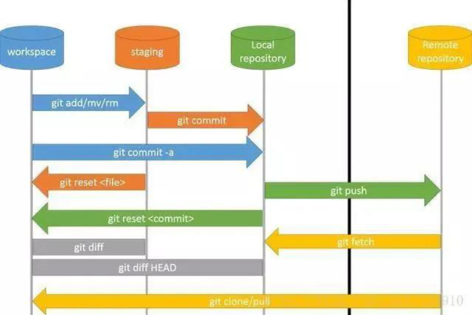

### SVN与Git概念

**Git 概念：**

Git是一个分布式版本控制系统

Git 最核心的一个概念就是工作流。

- 工作区(Workspace)是电脑中实际的目录。
- 暂存区(Stage/index)类似于缓存区域，临时保存你的改动。
- 仓库区(Repository)，分为本地仓库和远程仓库。

通常提交代码分为三步：

1. git add从工作区提交到暂存区
2. git commit从暂存区提交到本地仓库
3. git push从本地仓库提交到远程仓库


操作图如下：




**SVN 概念：**

SVN是集中式的版本控制系统


- **repository（源代码库）：**源代码统一存放的地方
- **Checkout（提取）：**当你手上没有源代码的时候，你需要从repository checkout一份
- **Commit（提交）：**当你已经修改了代码，你就需要Commit到repository
- **Update (更新)：**当你已经Checkout了一份源代码， Update一下你就可以和Repository上的源代码同步，手上的代码就会有最新的变更

通常提交代码分为两步：

1. Update（获得最新的代码）
2. 修改后 Commit（大家就可以看到你的修改了）


### SVN与Git区别

**1、Git 是分布式的，SVN 不是**：这是 Git 和其它非分布式的版本控制系统，如 SVN，CVS 等，最核心的区别。

**2、Git 把内容按元数据方式存储，而 SVN 是按文件：**所有的资源控制系统都是把文件的元信息隐藏在一个类似 .svn、.cvs 等的文件夹里。

**3、Git 分支和 SVN 的分支不同：**分支在 SVN 中一点都不特别，其实它就是版本库中的另外一个目录。

**4、Git 没有一个全局的版本号，而 SVN 有：**目前为止这是跟 SVN 相比 Git 缺少的最大的一个特征。

**5、Git 的内容完整性要优于 SVN：**Git 的内容存储使用的是 SHA-1 哈希算法。这能确保代码内容的完整性，确保在遇到磁盘故障和网络问题时降低对版本库的破坏。

**6、Git可以离线操作，SVN必需要有网络**


### SVN与Git优缺点

**Git：**

优点：速度快，灵活；离线工作；适合多人协作开发

缺点：相对SVN上手时间久；代码保密性差（开发者把整个库克隆下来就可以完全公开所有代码和版本信息）


**SVN：**

优点：上手简单，管理方便；适合开发人数不多的项目；

缺点：依赖服务器（连不上则操作不了）；不适合开源多人开发，明确的权限管理机制


详细参照：https://www.cnblogs.com/Sungeek/p/9152223.html


以下未整理=====

### Git常用命令

ls  查看当前目录    clear  清空

git clone xxx 	   需要克隆的链接

git branch -r 		查看远程的分支名

git checkout -b new		创建了一个名称为new的分支并切换到new分支上去

git checkout -b new master		从master分支分化一个新分支名为new，并切换到new分支上去

git checkout -b 分支名 origin/分支名       切换分支    -b是切换远程分支

git branch		查看分支

git branch -v   查看分支 

git branch -a		本地分支和远程分支

git merge		合并分支

git status 		查看当前项目中文件的状态。（或查看冲突情况）

git stash		  能够将所有未提交的修改（工作区和暂存区）保存至堆栈中，用于后续恢复当前工作目录。

git stash pop		从git栈中获取到最近一次stash进去的内容，恢复工作区的内容。获取之后，会删除栈中对应的stash。

git stash list		查看所有的stash

git add .            收集当前目录下的所有文件，将文件添加到暂存区

git commit -m “如(首次提交)”

git pull			作用是从一个仓库或者本地的分支拉取并且整合代码。取回远程分支的更新，与本地的合并（如远程分支有新加的分支，通过此命令后本地才可以查看到）

git push		推送到远程服务器上对应的分支；如果当前分支只有一个远程分支，那么主机名都可以省略，如 git push

git push origin master	将本地D:\aqin_test1\目录下的内容同步到码云仓库，origin(远程主机名)

git fetch             将远程的某名的更新全部取回本地

git fetch origin   


git push origin feature-branch:feature-branch    //推送本地的feature-branch(冒号前面的)分支到远程origin的feature-branch(冒号后面的)分支(没有会自动创建)

git push origin dev.ZZC:dev.ZZC       将本地分支推送到远程分支   冒号两边>  本地分支名：远程分支名


git branch --set-upstream-to=origin/remote_branch your_branch   其中，origin/remote_branch是你本地分支对应的远程分支；your_branch是你当前的本地分支。 // 关联远程/同步分支

​     `git branch --set-upstream-to=origin/dev.ZZC`    


可以重新指定与远程同名的分支（推荐这种方式，执行之后以后就可以git push了）

 git push -u origin dev/ft/gdsexchange


切换分支

git branch -a  //查看远程分支

git checkout -b  ...  origin/...      点点点是要切换的目标分支

git checkout  ...


提交

git status		检查修改的代码

git stash		把修改的代码放到内存

git pull			拉代码，把远程仓库的代码拉取下来

git stash pop		把代码从内存拉取出来    先当与把我的分支远程的代码和现在修改的代码合并

git add .			加入要提交的代码

git commit -m xxx		提交备注

git push		提交代码


合并：先提交代码，提交完在git pull拉取；然后查看git branch -a；进行合并：git merge '合并的名' （如：git merge origin/dev）  在git pull

shift+：(冒号)+ q        》》在回车，退出


：wq!


// 切换到dev解决冲突在回来

git checkout dev

git merge dev.ZZC  //  合并我的到dev,为最新

git commit -am 'merge dev.ZZC'

git checkout dev.ZZC

git commit -m '解决冲突2'   //


git fetch    //  先用fetch命令更新remote索引 ;   远程有新分支时本地查不到用


操作失误 要  恢复git stash 

git stash pop 会删除上一步的git stash 暂存，

git stash  ; git stash pop 操作失误，没push又git stash导致修改的没了

第一，使用 git stash list 查看

第二，使用       `git stash apply stash@{c4ba289}`      { 这里放要恢复的id }   就可以了


git merge origin/zzc 这样合并后并退回 使用 git merge --abort 


```
git branch -vv
```

 查看关联的分支

修改后合并进远程某分支

​     `git push origin dev.zzc:dev`    


1. `git log` - 查看之前每次的commit记录列表
2. `git show` - 查看最近一次已commit的文件修改信息
3. `git show commit id`即可查看指定的文件修改详情


（一股脑）使用`merge`命令合并分支，解决完冲突，执行`git add .`和`git commit -m'fix conflict'`。这个时候会产生一个commit。

（交互式）使用`rebase`命令合并分支，解决完冲突，执行`git add .`和`git rebase --continue`，不会产生额外的commit。这样的好处是，‘干净’，分支上不会有无意义的解决分支的commit；坏处，如果合并的分支中存在多个`commit`，需要重复处理多次冲突。

`git pull`和`git pull --rebase`区别：`git pull`做了两个操作分别是‘获取’和合并。所以加了rebase就是以rebase的方式进行合并分支，默认为merge。

